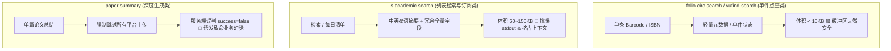

# 面向 Agent 友好的 Skill 与 API 综合评估报告

本报告严格依据 [《面向Agent友好的API设计与评估通用框架》](file:///f:/Github/skill-creator/project/%E9%9D%A2%E5%90%91Agent%E5%8F%8B%E5%A5%BD%E7%9A%84API%E8%AE%BE%E8%AE%A1%E4%B8%8E%E8%AF%84%E4%BC%B0%E9%80%9A%E7%94%A8%E6%A1%86%E6%9E%B6.md)，对以下 5 个现有技能（Skills）及其底层 API 交互模式进行深度评估与诊断：

1. [`folio-circ-search`](file:///f:/Github/skill-creator/.opencode/skills/folio-circ-search)（FOLIO 图书馆藏流通状态检索）
2. [`folio-req-search`](file:///f:/Github/skill-creator/.opencode/skills/folio-req-search)（FOLIO 基藏书库读者索书/预约报表检索）
3. [`lis-academic-search`](file:///f:/Github/skill-creator/.opencode/skills/lis-academic-search)（LIS-RSS 图情学智能订阅与学术检索）
4. [`paper-summary`](file:///f:/Github/skill-creator/.opencode/skills/paper-summary)（中文学术论文全文下载与 AI 摘要生成）
5. [`vufind-search`](file:///f:/Github/skill-creator/.opencode/skills/vufind-search)（VuFind OPAC 书目与复本馆藏检索）

---

## 一、 综合评估总览与评级矩阵

根据框架中的 **4 大核心优化原则** 与 **5 项自查清单（Checklist）**，5 个技能的合规评级与主要风险暴露如下：

### 1.1 Checklist 5 项指标自查矩阵

| 评估维度 / 检查项 | folio-circ-search | folio-req-search | lis-academic-search | paper-summary | vufind-search |
| :--- | :---: | :---: | :---: | :---: | :---: |
| **1. 缓冲区安全**（stdout < 30KB，防截断崩溃） | 🟢 **安全**（单本点查） | 🟡 **中危**（100条报表+冗余附注） | 🔴 **高危**（`--all` 翻页合并或每日批量可破 100KB） | 🟢 **安全**（单篇任务 < 10KB） | 🟢 **安全**（单本复本 < 10KB） |
| **2. 字段稠密度**（长文本隔离、`fields=core`） | 🟡 **适中**（无长文本，但无字段过滤） | 🟡 **冗余**（多达 16 列且无剪裁） | 🔴 **严重超标**（中英双语长摘要×3份拷贝，无裁剪） | 🟡 **良好**（以摘要为主，支持 `--save-md`） | 🟢 **轻量**（元数据短字段） |
| **3. 消费双轨制**（轻量感知 vs 静态文件沉淀） | ⚪ **不适用**（单件点查业务） | 🔴 **缺失**（历史索书流水未做文件沉淀） | 🔴 **严重缺失**（百篇文献强塞 Prompt，无文件导出） | 🟡 **部分具备**（支持脚本落盘，无服务端直链） | ⚪ **不适用**（单件点查业务） |
| **4. 字段纯净度**（剥离内部状态，杜绝幻觉） | 🟡 **轻微污染**（内部注释、馆员操作人） | 🔴 **严重污染**（每行嵌入 `_http_note`，历史废弃原因） | 🔴 **高危幻觉**（`failed:true` 占位0分、`fallback:true`） | 🔴 **极高危反模式**（顶层 `success:false` 强行反转） | 🟢 **纯净**（纯客观书目与馆藏状态） |
| **5. 契约边界**（正交通用、不写死 Agent 特例） | 🟢 **优良**（FOLIO 标准 REST，脚本自编排） | 🟡 **耦合**（服务端表单要求必传起始时间） | 🟡 **耦合**（长轮询排队阻塞 HTTP，多模式鉴权混乱） | 🔴 **严重破坏**（摘要主链路与 5 平台推送强绑定） | 🟢 **优良**（OPAC 标准抓取适配） |
| **综合合规评级** | **良好 (B+)** | **存在隐患 (C)** | **重大整改 (D)** | **架构缺陷 (C-)** | **优良 (A-)** |

> [!NOTE]
> **评级标准说明**：
> - 🟢 **优秀 / 安全**：完全符合框架原则，对 Agent 上下文与认知极度友好；
> - 🟡 **良好 / 适度**：存在轻微字段冗余或边界耦合，但在预期负载下不至于直接诱发系统崩溃；
> - 🔴 **高危 / 缺陷**：违反 Agent 友好核心原则，存在硬截断崩溃、严重负面幻觉诱发或严重上下文膨胀风险，亟需整改。

---

## 二、 逐个技能深度剖析与诊断



---

### 2.1 `folio-circ-search` 评估

* **定位**：按书刊条码（Barcode）即时查询单件图书在 FOLIO 中的流通状态（借出/归还）及借出明细。
* **API 底座**：FOLIO OKAPI REST 接口（`/bl-users/login`, `/shl-disc-inventory/items`, `/items-with-instance`, `/circulation/loans`, `/users`）。

#### 优势与合规项
1. **契约通用法则（原则 2）落地极佳**：FOLIO 服务端保持标准开源 RESTful 体系，未针对 Agent 进行任何侵入式硬编码。脚本在客户端充当编排器（Orchestrator），按需串联书目、实例与借还明细，符合“API 提供原子积木，Agent 负责拼装”。
2. **缓冲区安全**：业务本质是高精度的单件状态点查（Point-Lookup），单本图书响应体积在 1.5KB~3KB 之间，远低于 30KB 安全红线。

#### 存在问题与改进空间
1. **时区歧义引起的推理幻觉**：HTTP 路径与浏览器路径时间格式不一致（HTTP 转换为系统本地时区，浏览器直接抓取前端渲染字符串），在跨日/逾期计算时可能引发大模型时间线幻觉。
2. **内部注释字段未脱敏**：`fields["内部注释"]` 直接拉取了馆员的历史备注（如盘点异常、损毁记录等），可能干扰模型对书籍当前可用性的判断。

---

### 2.2 `folio-req-search` 评估

* **定位**：按馆藏条码查询基藏书库读者的索书与预约流转记录（出库、接收、归还、入库）。
* **API 底座**：同源 OKAPI REST（`POST /okapi/shl-ssinside/report/requestSearch`）。

#### 核心问题诊断
1. **高频字符串注入导致上下文污染（违背原则 3）**：
   在 `_req_row` 转换中，代码为每一条记录都硬编码插入了说明字符串：
   ```python
   row["_http_note"] = "HTTP 路径（POST /okapi/shl-ssinside/report/requestSearch，与页面同源）：归还日期/入库时间/入库人等字段接口仅在相应状态时返回，未返回即 \"/\"。"
   ```
   **危害**：若一次检索返回 30 条历史记录，这段约 140 字节的说明文字会在 JSON 中无意义地**重复出现 30 次**（累计 4.2KB，占用上千 Token），不仅极易逼近 stdout 缓冲区临界点，更会严重稀释大模型注意力。
2. **缺乏消费双轨制（原则 1）**：
   报表默认返回多达 16 列字段，且包含历史流水。若一本图书历经数十次借还索书，全部记录直接推向 stdout，无 `fields=core`（如仅需：索书单号、读者卡号、当前状态、索书时间）的轻量视图，亦无文件落地直链。
3. **服务端非正交的时间窗口绑定（原则 2）**：
   服务端报表强制必须提供起始时间（`startTime`），否则返回空。客户端为了让 Agent 能用，不得不硬编码推导“前 4 个月的第一天”，给调用端带来了隐蔽的心智负担。

---

### 2.3 `lis-academic-search` 评估（高危整改项）

* **定位**：图情学术文章统一检索（语义/关键词/混合/相关）及「我的每日」JEV 评分推送。
* **API 底座**：`POST /api/external/search`、`POST /api/external/my-daily`。

#### 核心问题诊断
1. **缓冲区高危崩溃（Checklist 1 不及格）**：
   - 检索分支提供了 `--all` 翻页抓取开关，脚本会在客户端无节制地向 `merged["results"]` 累加所有页面数据，并在最后一次性打印单行 JSON。当命中 50~100 篇文献时，JSON 体积将飙升至 **80KB~150KB**，直接触发操作系统管道截断（Windows 64KB / Linux 40KB），导致大模型端直接抛出 `JSONDecodeError: Unterminated string`。
   - 「我的每日」单日文章数量通常在几十至上百篇（如实测 108 篇），全量推向 stdout，存在同样的截断崩溃风险。
2. **长文本极端稠密与字段三重拷贝（违背原则 1 与 Checklist 2）**：
   在 `normalize_daily_article` 中，数据结构如下：
   - 标题字段并存：`title`（英文）、`title_zh`（中文）、`title_display`（展示）；
   - 摘要字段并存：`summary`（长文本英文）、`summary_zh`（长文本中文）、`summary_display`（展示长文本）；
   **危害**：单篇文献的摘要文本被**复制了 3 份**注入 JSON。100 篇文献的摘要量相当于数十万字符，在大模型 Prompt 中造成极度严重的“大海捞针”效应，导致注意力崩溃且消耗天量 Tokens。未提供 `fields=core` 过滤机制。
3. **诱发幻觉的状态标记字段（违背原则 3）**：
   - `failed: true`：当 JEV 大模型评分调用失败时，服务端返回占位记录，分数为 0 并带上 `failed: true`。尽管文档告知需沉底，但模型极易误认为“该文章质量低劣”或误判为“整体检索执行失败”。
   - `ranked: false` 与 `fallback: true`：内部降级标志混在实体属性中，加剧了推理噪声。
4. **鉴权与参数设计的非正交性（原则 2 & 5）**：
   - 检索接口的 `user_id` 宣称支持 Request Body，但实测服务端只读 URL Query 参数，导致客户端必须双发兼容；
   - 检索使用全局 `x-api-key`，而每日推送强制明文传递用户个人的 `username` + `password`，两种鉴权模式割裂，加重了 Agent 编排复杂性。

---

### 2.4 `paper-summary` 评估（典型反模式案例）

* **定位**：中文学术论文全文下载、校验与 AI 摘要生成。
* **API 底座**：FastAPI 封装的 `POST /process`、`GET /process/status/{task_id}`。

#### 核心问题诊断
1. **服务端契约严重污染导致“成功即失败”认知反转（极端违背原则 3 & 5）**：
   - **痛点暴露**：服务端设计的 `/process` 接口将“摘要生成”与“多平台分发（HiAgent、LIS-RSS、Memos、Blinko、企业微信）”硬编码捆绑在同一接口中，且接口顶层的 `success` 字段判定逻辑是：**“至少有一个分发平台上传成功才算 success=true”**。
   - **灾难性后果**：当前 Skill 明确要求“只生成摘要，绝不外发推送”，因此客户端恒定发送 `push_*=false`。这导致服务端的顶层 `success` **永远返回 `false`**！
   - **客户端缝合怪修补**：Skill 客户端被迫在 `outcome()` 函数中完全推翻服务端的 `success` 字段，自己硬写逻辑去解析三段流水线（`pdf_download`, `pdf_validate`, `pdf_summary`）是否成功。
   - **评估定性**：这是典型的**契约边界倒错**与**语义污染**。API 未提供纯粹的“原子积木”，将边缘推送副反应反客为主定义为主状态，是构建面向 Agent 友好 API 的典型反面教材。
2. **微信推送通道无法被客户端关闭的隐蔽风险**：
   客户端即使发送 `push_wechat: false`，服务端因内部环境变量生效仍可能触发微信分发。此种内部不可控行为给 Agent 的行为确定性带来严重风险。

---

### 2.5 `vufind-search` 评估

* **定位**：按 ISBN 抓取图书馆 VuFind OPAC 系统的书目、主题与复本馆藏状态。
* **API 底座**：VuFind Web 前端页面与 `AjaxTab?tab=holdings` 动态渲染片段。

#### 优势与合规项
1. **轻量与纯净**：返回纯粹客观的物理元数据（索书号、书名、责任者、出版社、馆藏地、状态），无任何平台内部流转/锁/去重标记，模型认知负担极轻。
2. **人机拦截的语义保真**：面对 WAF 的“权限验证”，代码精准识别并上报为网络出口 IP 信誉问题，没有粗暴地归结为“该书不存在”，彻底切断了模型因反爬拦截而产生的“文献不存在”幻觉。
3. **安全边界**：单本图书的复本量在受控范围，stdout 体积通常在 3KB~8KB，极为安全。

---

## 三、 核心差距与重构演进建议

根据通用框架的标准范式（正如 `cnki-search` 所实现的），对需要整改的技能提出以下演化建议：

```mermaid
graph LR
    subgraph 改造前 (Current Issues)
        R1[全量双语长摘要强塞 stdout]
        R2[每行无意义重复嵌入 _http_note]
        R3[顶层状态反转 success=false]
    end

    subgraph 改造后 (Agent-Friendly Paradigm)
        A1[fields=core & limit=10 预览]
        A2[全量沉淀为静态 JSON/Excel 直链]
        A3[剥离内部解释与推送状态字段]
    end

    R1 --> A1
    R1 --> A2
    R2 --> A3
    R3 --> A3
```

### 1. `lis-academic-search` 整改路线（优先级：P0 - 紧急）

1. **引入双轨分离机制（原则 1）**：
   - **感知轨**：检索与每日推荐默认启用 `fields=core`（仅返回 `articleId`, `title_display`, `score/relevance_percent`, `source`, `url`），去除所有 `summary` 长文本与重复的双语拷贝，`limit` 默认严格限制在 10~20 条。单次 stdout 体积从 100KB 骤降至 3KB 以下。
   - **留存轨**：针对 `--all` 或大批量导出，不再向 stdout 打印巨大 JSON，而是将全量结构化数据在客户端落盘为 `lis_results_<timestamp>.json`，并在 stdout 中仅输出本地文件绝对路径供模型转交用户。
2. **清洗内部状态字段（原则 3）**：
   - 过滤掉 `failed: true` 占位条目，或者仅在汇总统计 `counts.failed` 中体现，绝不将带 0 分与 `failed: true` 的伪实体塞入文档列表。

### 2. `folio-req-search` 整改路线（优先级：P1 - 重要）

1. **移除行内重复的注记字符串**：
   - 彻底删除 `_req_row` 中向每一行灌入的 `row["_http_note"]`。对于 HTTP 路径字段缺失的说明，仅在顶层输出一次 `meta.note`，或直接通过 `SKILL.md` 指导模型认知，不得在数据行中无限复制。
2. **支持轻量视图与状态提取**：
   - 增加 `--latest` 选项，默认仅返回该条码最新的一笔索书状态明细，避免几十条历史流水无节制涌入 Prompt。

### 3. `paper-summary` 整改建议（服务端架构重构）（优先级：P1 - 重要）

1. **契约正交化解耦（原则 2 & 5）**：
   - 服务端接口应当彻底分离 **“生成摘要（Core）”** 与 **“通知推送（Notification/Sync）”**。
   - `/process` 顶层的 `success` 必须只代表**摘要流水线本身**是否成功生成；第三方推送应当作为可选的异步 Hook 或独立的子端点存在，绝不可让推送失败或跳过导致核心业务状态变为 `false`。

---

## 四、 结论与审查对照清单

| 技能名称 | 核心定性 | 最关键整改措施 |
| :--- | :--- | :--- |
| **`folio-circ-search`** | 整体优秀，轻量合规 | 规范时间戳时区转换，避免大模型时间线幻觉。 |
| **`folio-req-search`** | 存在局部上下文污染 | 立即剔除数据行中重复出现的 `_http_note` 字段。 |
| **`lis-academic-search`** | **高危隐患，急需重构** | **推行感知/留存双轨制，增加 `fields=core`，杜绝 `--all` 撑爆 CLI 缓冲区。** |
| **`paper-summary`** | 契约倒错，客户端勉强修补 | 推动服务端接口正交解耦，使顶层 `success` 回归摘要生成本质。 |
| **`vufind-search`** | 纯净轻量，边界严谨 | 保持现状，已高度适配 Agent 调用模式。 |
