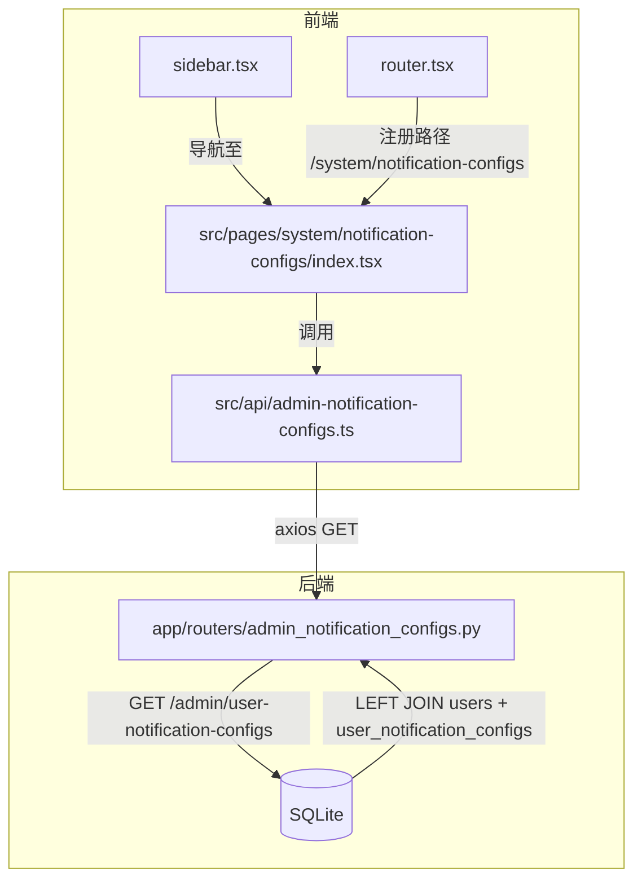

# Admin 通知配置列表 设计文档

- **Status**: Proposal
- **Date**: 2026-05-20

## 1. 目标与背景

将 Webhook 通知从全局配置改为按账号独立配置后（commit `efbac5b`），admin 无法纵览全局所有账号的 Webhook 配置状态。新增一个 admin-only 页面，以列表形式展示所有用户的通知配置（用户名、Webhook URL、启用状态、更新时间），**只读**。

## 2. 详细设计

### 2.1 模块结构

**后端**（新增 1 个路由文件 + 注册）：
- `app/routers/admin_notification_configs.py` — admin-only 列表查询接口
- `app/main.py` — 注册新 router

**前端**（新增 1 个页面 + 1 个 API 文件 + 路由 + 侧边栏）：
- `src/api/admin-notification-configs.ts` — API 调用函数
- `src/pages/system/notification-configs/index.tsx` — 列表页面
- `src/router.tsx` — 注册路由
- `src/components/layout/sidebar.tsx` — 新增导航项

### 2.2 核心接口

#### `GET /admin/user-notification-configs`

```
GET /api/v1/admin/user-notification-configs
Authorization: Bearer <token>
```

权限：`require_admin_user`

Response `200`:
```json
{
  "items": [
    {
      "user_id": 1,
      "username": "admin",
      "email": "admin@example.com",
      "role": "admin",
      "is_active": true,
      "webhook_url": "https://qyapi.weixin.qq.com/...",
      "enabled": true,
      "updated_at": "2026-05-20T13:04:22"
    }
  ],
  "total": 5
}
```

查询逻辑：`LEFT JOIN user_notification_configs ON users.id = user_notification_configs.user_id`，未配置的用户也返回（`webhook_url: null, enabled: false`）。

### 2.3 前端页面

**路径**: `/system/notification-configs`

**页面布局**（沿用现有 admin 页面风格，参考 `src/pages/system/config/index.tsx`）：

| 列 | 说明 |
|---|---|
| 用户名 | 显示 username + email |
| 角色 | admin / user |
| Webhook URL | 文本显示，过长时省略（`text-overflow: ellipsis`） |
| 状态 | Badge 显示"已启用"/"已关闭"/"未配置" |
| 最后更新 | `updated_at` 格式化显示 |

**交互**：
- 仅查看，无编辑操作
- 页面加载时请求数据

**侧边栏位置**：在 admin「设置」区域，「系统配置」之后新增一项：
- 图标：`Webhook`
- 标签：`通知配置`

### 2.4 Mermaid 组件树



### 2.5 数据流

```
[Admin 点击侧边栏「通知配置」]
  → router 加载 AdminNotificationConfigsPage
  → useEffect 调用 fetchAll()
  → axios GET /api/v1/admin/user-notification-configs
  → FastAPI require_admin_user 鉴权
  → SQLAlchemy 查询 users LEFT JOIN user_notification_configs
  → 返回 JSON → 前端渲染 Table
```

## 3. 测试策略

| 层级 | 测试项 | 说明 |
|---|---|---|
| 后端 | admin 可获取全部配置 | 正常路径 |
| 后端 | user 角色调用返回 403 | 权限校验 |
| 后端 | 未配置通知的用户在列表中 | 边界条件（LEFT JOIN 结果为 null） |
| 前端 | 页面正常渲染数据 | 通过 mock 数据验证各列展示 |
| 前端 | 空数据状态 | 无用户时显示"暂无数据" |
