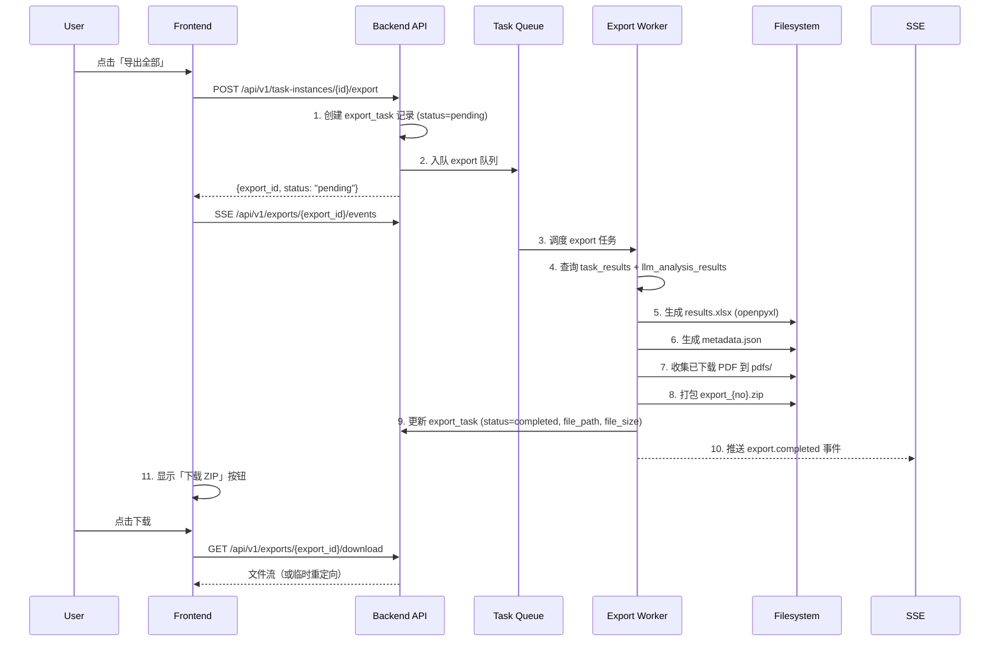

# M9: 数据导出打包、Webhook 通知与磁盘监控 设计文档

- **Status**: Proposal
- **Date**: 2026-05-15

## 1. 目标与背景

完成系统剩余三个关键能力：
1. **数据导出打包**：将已完成任务实例的检索结果、LLM 分析结果和已下载 PDF 打包为 ZIP 供用户下载
2. **Webhook 通知**：任务执行阶段变更时通过企业微信群机器人推送通知
3. **磁盘空间监控**：低磁盘空间时自动告警

## 2. 详细设计

### 2.1 导出打包模块 (Export Worker)

#### 2.1.1 模块结构

```
backend/
├── app/services/export_service.py      # 导出业务逻辑：ZIP 生成、元数据 JSON、Excel 组装
├── app/worker/export_worker.py         # Export Worker 实现（异步打包，SSE 推送）
├── app/routers/exports.py              # 导出 API 端点（启动导出、查询状态、下载）
└── app/models/export_task.py           # 导出任务记录表（追踪导出状态、过期时间）
```

#### 2.1.2 ZIP 产物流规范

```
export_{instance_no}.zip
├── metadata.json              # 任务元数据（名称、参数、时间戳、统计）
├── results.xlsx               # 检索结果（全部字段 + LLM 分析字段合并）
├── analysis_results.xlsx      # LLM 分析结果明细
└── pdfs/                      # PDF 子目录（仅已下载成功的）
    ├── 1.pdf
    ├── 2.pdf
    └── ...
```

**metadata.json Schema**:
```json
{
  "instance_no": "T20260515001",
  "meta_task_name": "人工智能 医疗",
  "creator": "admin",
  "status": "completed",
  "started_at": "2026-05-15T10:00:00",
  "completed_at": "2026-05-15T11:30:00",
  "statistics": {
    "search_total": 500,
    "valid_data": 480,
    "duplicates": 20,
    "analyzed": 475,
    "downloaded": 120
  },
  "search_params": { ... }
}
```

#### 2.1.3 导出流程



#### 2.1.4 export_task 表结构

```sql
CREATE TABLE export_tasks (
    id              INTEGER PRIMARY KEY AUTOINCREMENT,
    task_instance_id INTEGER NOT NULL,
    creator_id      INTEGER NOT NULL,
    status          VARCHAR(20) DEFAULT 'pending' CHECK(
        status IN ('pending', 'running', 'completed', 'failed')
    ),
    file_path       VARCHAR(500),            -- ZIP 文件路径
    file_size       INTEGER,                 -- 文件大小（字节）
    error_message   TEXT,
    expires_at      TIMESTAMP,               -- 临时链接过期时间（创建 + 24h）
    created_at      TIMESTAMP DEFAULT CURRENT_TIMESTAMP,
    completed_at    TIMESTAMP,
    FOREIGN KEY (task_instance_id) REFERENCES task_instances(id) ON DELETE CASCADE,
    FOREIGN KEY (creator_id) REFERENCES users(id) ON DELETE CASCADE
);
```

#### 2.1.5 API 端点

```http
POST   /api/v1/task-instances/{id}/export          # 启动导出
GET    /api/v1/exports/{export_id}/status           # 导出状态查询
GET    /api/v1/exports/{export_id}/download         # 下载 ZIP（文件流）
GET    /api/v1/exports/{export_id}/events           # SSE 导出进度
```

**启动导出响应**：
```json
{
  "export_id": 1,
  "status": "pending",
  "message": "Export task queued"
}
```

**下载端点**：读取本地 ZIP 文件，返回 `application/zip` 流式响应，设置 `Content-Disposition: attachment; filename="export_T20260515001.zip"`。

#### 2.1.6 文件生命周期

- 导出 ZIP 存储在 `{data_dir}/exports/` 目录
- 临时下载链接有效期 24 小时（`expires_at`），过期后返回 410 Gone
- 定期清理任务（每日一次）扫描 `expires_at < NOW()` 的导出文件并删除

#### 2.1.7 Export Worker 实现

```python
class ExportWorker(BaseWorker):
    """
    queue_type: export
    concurrency: 2
    异步打包 ZIP，SSE 推送进度
    """
    async def process(self, db, item_id, params_json):
        # 1. 解析参数，获取 instance_id / export_id
        # 2. 更新 export_task -> running
        # 3. 查询 task_results + llm_analysis_results
        # 4. 生成 results.xlsx（openpyxl）
        # 5. 生成 metadata.json
        # 6. 收集已下载 PDF（copy 到临时目录）
        # 7. 打包 ZIP（shutil.make_archive 或 zipfile）
        # 8. 更新 export_task -> completed
        # 9. SSE 广播 export.completed
```

---

### 2.2 Webhook 企业微信通知

#### 2.2.1 模块结构

```python
backend/app/services/wecom_notifier.py   # 企微 Webhook 推送服务
```

#### 2.2.2 触发场景

| 场景 | 事件类型 | 触发位置 |
|------|----------|----------|
| 检索完成 (search_completed) | `task.progress` | `cnki_worker.py` |
| 分析完成 (analyzing_completed) | `task.progress` | `llm_worker.py` |
| 下载完成 (completed) | `task.completed` | `download_worker.py` |
| 任务失败 (failed) | `task.failed` | 各 Worker 的失败路径 |

#### 2.2.3 Webhook 配置读取

从 `system_configs` 表读取 `key = 'webhook_enterprise_wechat'` 的值作为 Webhook URL。

#### 2.2.4 推送实现

```python
class WeComNotifier:
    """企业微信群机器人通知。"""

    def __init__(self, db):
        self.webhook_url = None  # 懒加载

    async def _load_webhook(self, db):
        """从 system_configs 加载 Webhook URL"""
        ...

    async def send_notification(self, db, instance_data: dict):
        """
        发送 Markdown 消息到企业微信群。
        消息模板见需求规格说明书 4.8.3 节。
        使用 requests.post 发送 JSON payload。
        """
        # GET https://qyapi.weixin.qq.com/cgi-bin/webhook/send?key=xxx
        # POST {"msgtype": "markdown", "markdown": {"content": "..."}}
```

#### 2.2.5 调用点

在 `cnki_worker.py`、`llm_worker.py`、`download_worker.py` 各自完成后异步调用：

```python
from app.services.wecom_notifier import WeComNotifier
notifier = WeComNotifier()
await notifier.send_notification(db, {
    "meta_task_name": ...,
    "username": ...,
    "instance_no": ...,
    "status": "completed",
    "started_at": ...,
    "completed_at": ...,
    "stats": { "total": ..., "valid": ..., "analyzed": ..., "downloaded": ... }
})
```

**注意**：通知失败（如网络超时、URL 无效）不应影响主流程，需 try/except 吞掉异常并记录日志。

---

### 2.3 磁盘空间监控

#### 2.3.1 实现方式

在 `main.py` 的 `lifespan` 中启动一个后台定时任务（`asyncio.create_task`），每分钟检查一次磁盘空间。

#### 2.3.2 监控逻辑

```python
async def disk_monitor_loop():
    """每分钟检查磁盘空间，低于阈值时触发告警。"""
    while True:
        await asyncio.sleep(60)
        usage = shutil.disk_usage(settings.data_dir)
        free_gb = usage.free / (1024 ** 3)
        if free_gb < 10:
            logger.warning(f"Low disk space: {free_gb:.1f} GB free")
            # 发送企微通知（如果可以）
```

#### 2.3.3 告警抑制

- 首次触发后，24 小时内不重复发送相同级别的告警
- 使用 `last_alert_time` 变量控制频率

---

### 2.4 前端导出功能

#### 2.4.1 导出按钮

在 `task-result/index.vue` 的批量操作栏添加：

| 按钮 | 条件 | 行为 |
|------|------|------|
| 导出选中 Excel | 至少选中 1 条 | 调用批量导出 API，下载 Excel |
| 导出全部 | 实例已完成 | 启动 ZIP 打包，SSE 监听进度 |
| 打包下载 ZIP | 任务完成 | 下载已完成的 ZIP |

#### 2.4.2 已有 API 扩展

```typescript
// src/api/taskInstance.ts - 新增
export const startExport = (id: number): Promise<any> =>
  http.request("post", `/api/v1/task-instances/${id}/export`)

export const getExportStatus = (exportId: number): Promise<any> =>
  http.request("get", `/api/v1/exports/${exportId}/status`)

export const downloadExport = (exportId: number): void => {
  const token = getToken()
  window.open(`/api/v1/exports/${exportId}/download?token=${token}`, "_blank")
}
```

#### 2.4.3 UI 交互

- 点击「导出全部」后按钮变为 loading 状态
- SSE 推送 `export.progress` / `export.completed` / `export.failed`
- 完成后按钮变为「下载 ZIP」，点击触发文件下载
- 导出失败显示错误 Toast +「重试」按钮

---

## 3. 测试策略

| 测试范围 | 测试项 | 方式 |
|----------|--------|------|
| Export Service | ZIP 文件生成完整性校验 | 单元测试 |
| Export Worker | 任务状态流转 (pending→running→completed) | 集成测试 |
| Export API | 启动导出 / 状态查询 / 文件下载 / 过期 | 集成测试 |
| WeCom Notifier | Markdown 消息格式正确性 | 单元测试 (mock requests) |
| WeCom Notifier | Webhook URL 为空时静默跳过 | 单元测试 |
| Webhook 调用点 | 各 Worker 完成后自动调用通知 | 集成测试 |
| 磁盘监控 | 告警频率控制逻辑 | 单元测试 (mock disk_usage) |

## 4. 配置文件变更

在 `.env` 中添加（可选覆盖）：

```env
EXPORT_LINK_EXPIRY_HOURS=24
DISK_ALARM_THRESHOLD_GB=10
```
