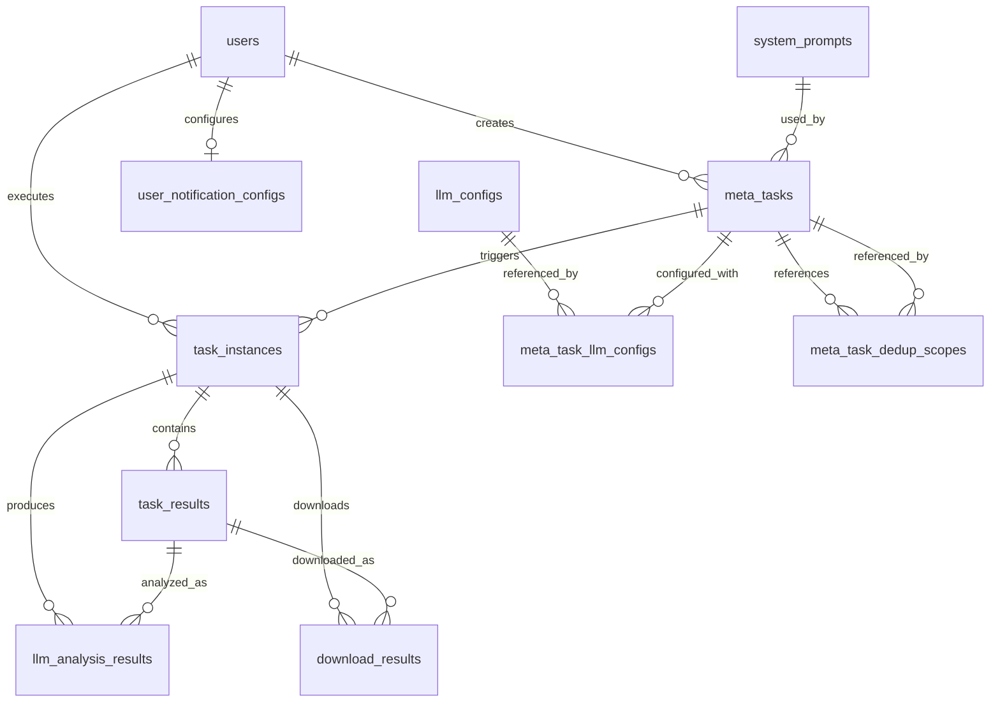

# CNKI 学术定题服务系统 - 需求规格说明书

**版本**：v2.7  
**日期**：2026-08-03  
**项目名称**：CNKI 学术定题服务系统

---

## 一、文档说明

### 1.1 目的

本文档 defines CNKI 学术定题服务系统的功能性需求，作为系统设计、开发、测试和验收的统一依据。

### 1.2 术语定义

| 术语 | 解释 |
|------|------|
| **元任务 / 任务模板** | 预先配置好的任务定义，包含检索参数、LLM 配置等 |
| **任务实例** | 一次具体的任务执行记录，由元任务触发产生 |
| **检索结果 / 文章** | CNKI 检索返回的文献记录，存入 `task_results` 表 |
| **去重** | 识别并标记同一元任务内（可配置参考其他元任务）的重复文献 |
| **LLM 分析** | 调用大模型对检索结果进行智能评分、分类 |
| **下载任务** | 将审核通过的文献批量下载为 PDF |
| **SSE** | Server-Sent Events，服务器向客户端推送进度事件 |

---

## 二、系统角色与权限

### 2.1 角色定义

| 角色 | 标识 | 描述 |
|------|------|------|
| 管理员 | `admin` | 拥有系统所有权限，可管理所有数据与配置 |
| 普通用户 | `user` | 仅能操作自己创建的数据，权限受限 |

### 2.2 权限矩阵

| 功能模块 | admin | user |
|----------|-------|------|
| **用户管理** | CRUD | 只读（仅查看自己） |
| **LLM 配置管理** | CRUD | 只读 |
| **系统提示词管理** | CRUD | 只读 |
| **系统设置** | UPDATE | 只读 |
| **任务模板** | CRUD（所有） | CRUD（仅自己的） |
| **任务实例** | 查看/操作（所有） | 查看/操作（仅自己的） |
| **检索结果数据** | CRUD（所有） | CRUD（仅自己的） |
| **数据导出** | ✅（所有数据） | ✅（仅自己的数据） |
| **操作日志** | 查看（所有） | 查看（仅自己的） |

**说明**：
- `C` = 创建，`R` = 读取，`U` = 更新，`D` = 删除
- 普通用户由管理员创建，登录使用账号密码
- 所有数据行需记录 `creator_id` 用于权限隔离

---

## 三、核心业务流程

### 3.1 端到端流程


### 3.2 状态流转图（任务实例）

```
┌─────────┐
 │ pending │  (刚创建，等待队列)
 └────┬────┘
      │ 队列调度
      ▼
┌──────────┐
 │ running │  (CNKI 检索中)
 └────┬────┘
      │ 检索完成
      ▼
┌─────────────────┐
 │ search_completed │ (数据已入库，待分析)
 └────┬────┘
      │ 自动触发分析
      ▼
┌─────────────────┐
 │ analyzing │ (LLM 批量分析中)
 └────┬────┘
      │ 分析完成
      ▼
┌─────────────────────────┐
 │ analyzing_completed │ (分析就绪，等待人工审核)
 └────┬────┘
      │ 人工审核通过 → 入队下载任务
      ▼
┌──────────┐
 │ downloading │ (PDF 下载中)
 └────┬────┘
      │ 全部完成
      ▼
┌─────────┐
 │ completed │
 └─────────┘

任意阶段可失败 → failed (发送通知)
```

---

## 四、功能需求详述

### 4.1 任务模板管理（元任务）

#### 4.1.1 创建模板

**输入字段**：

| 字段分组 | 字段名 | 类型 | 必填 | 说明 |
|----------|--------|------|------|------|
| 基础信息 | `name` | 字符串 | 是 | 任务名称（最多 200 字） |
| | `description` | 文本 | 否 | 任务描述 |
| CNKI 检索参数 | `search_mode` | 枚举 | 否 | 检索模式：`basic`（普通）或 `professional`（专业）。不传时默认为 `basic` |
| | `queries` | 字符串数组 | 条件必填 | `basic` 模式下的检索词列表（≥1个），系统将所有检索词合并为一条专业检索式 `SU=(K1+K2+...) OR TKA=(K1+K2+...)`，只执行 1 次检索 |
| | `query_group_a` | 字符串数组 | 条件必填 | `professional` 模式下主题A关键词组，组内关键词用 `+` 连接（OR 逻辑）；`query_group_a`、`query_group_b`、`au_group`、`fu_group` 至少一组非空 |
| | `query_group_b` | 字符串数组 | 条件必填 | `professional` 模式下主题B关键词组，组内关键词用 `+` 连接（OR 逻辑）；`query_group_a`、`query_group_b`、`au_group`、`fu_group` 至少一组非空 |
| | `au_group` | 字符串数组 | 否 | `professional` 模式下作者列表，组内作者用 `+` 连接（OR 逻辑），默认与 SU/TAK 表达式 AND 连接 |
| | `fu_group` | 字符串数组 | 否 | `professional` 模式下基金列表，组内基金用 `+` 连接（OR 逻辑），使用 `%` 运算符（`FU % (...)`），默认与 SU/TAK 表达式 AND 连接 |
| | `year_from` | 整数 | 否 | 起始年份（YYYY），与 `date_range` 互斥 |
| | `year_to` | 整数 | 否 | 结束年份（YYYY），与 `date_range` 互斥 |
| | `date_range` | 枚举 | 否 | 更新时间范围，与 `year_from`/`year_to` 互斥，可选值：`week`/`month`/`half-year`/`year`/`ytd`/`last-year` |
| | `core_only` | 布尔 | 否 | 是否仅核心来源：勾选 WJCI/SCI/EI/北大核心/CSSCI/CSCD/AMI |
| | `synonym_extend` | 布尔 | 否 | 是否勾选同义词扩展 |
| | `include_no_fulltext` | 布尔 | 否 | 是否包含无全文文献（默认仅看有全文） |
| | `max_export` | 整数 | **是** | 总导出上限，可选值：50/100/150/200/250/300/350/400/450/500 |
| LLM 分析配置 | `llm_config_ids` | JSON 数组 | 是 | 按优先级排列的 LLM 配置 ID 列表（如 `[3, 1, 2]`），优先使用第一个，失败时依次轮询；通过多选组件拖拽排序 |
| | `prompt_template_id` | 外键 | 否 | 关联 `system_prompts.id`（可选） |
| 执行设置 | `schedule_cron` | 字符串 | 否 | Cron 表达式（预留，V1 仅手动执行） |
| | `is_periodic` | 布尔 | 否 | 是否周期性任务 |
| 去重配置 | `dedup_scope_meta_task_ids` | JSON 数组 | 否 | 参考去重范围，选择其他任务模板的 ID 列表，所选模板的所有历史数据参与去重比对（详见 4.2.2） |

**业务规则**：
- 普通用户创建模板时，`llm_config_ids` 通过多选组件从**已启用**的配置列表中选择并拖拽排序（优先级从高到低），至少选择 1 个；`prompt_template_id` 从下拉列表中选择
- 管理员可创建、编辑所有配置；普通用户只能使用，不能修改配置
- 模板创建后，状态默认为 `active`，可在列表页启用/禁用
- `dedup_scope_meta_task_ids`：多选 checkbox 组件，普通用户仅显示自己创建的任务模板，管理员可看到所有模板。选择后检索结果不仅与当前模板的历史数据去重，同时也与所选所有参考模板的所有历史数据比对去重；不选择时仅执行当前模板内部的默认去重

#### 4.1.2 模板执行（生成实例）

**操作**：点击「立即执行」按钮

**系统行为**：
1. 生成唯一实例编号：`T{YYYYMMDD}{3位序列号}`（如 `T20260514001`）
2. 取 `meta_task.search_params` 作为基础，若用户执行时传入覆盖参数则合并，生成最终 `execution_params`（JSON 快照，实际执行以此为准）
3. 创建 `task_instances` 记录，初始状态 `pending`
4. 将 `instance_id` 加入任务队列（`cnki_search` 任务）
5. 前端跳转到任务实例详情页，开始 SSE 监听

#### 4.1.3 模板列表

**展示字段**：
- 任务名称、描述（截断）
- LLM 配置名称
- 创建者、创建时间
- 执行次数（关联 `task_instances` 计数）
- 状态（启用/禁用）
- 最后执行时间

**操作列**：
- [编辑] （仅自己的模板 / 管理员所有）
- [复制] 点击后创建新模板（名称追加"（副本）"），所有配置与原模板相同，并自动与原模板建立双向去重关系
- [立即执行]
- [删除] 删除模板及其所有任务实例及级联数据（实例正在运行中时禁用）
- [查看执行记录] → 跳转到该模板的实例列表页

---

### 4.2 CNKI 检索任务

#### 4.2.1 执行流程

```
┌─────────┐
 │ 任务入队 │  (Worker 轮询消费)
 └────┬────┘
      │
      ▼
┌─────────────────┐
 │ 浏览器启动/复用 │  (复用已登录的 Cookie)
 └────┬────┘
      │
      ▼
┌─────────────────┐
 │ CNKI 登录验证 │  (检测 Cookie 有效性)
 └────┬────┘
      │ 若失效 → 从 .env 自动登录或失败通知
      ▼
┌──────────────────────────────┐
 │ 进入新版高级检索页           │
 │ kns.cnki.net/kns8s/AdvSearch│
 └────┬────┘
      │
      ▼
┌──────────────────────────────┐
 │ 设置检索参数：               │
 │ · 普通检索：全部检索词合并  │
 │   为一条专业检索式          │
 │   SU=(K1+K2+...) OR         │
 │   TKA=(K1+K2+...)           │
 │ · 专业检索：用户自定义布尔式│
 │ · 年份 / 更新时间范围       │
 │ · 同义词扩展（可选）         │
 │ · 仅看有全文（默认）/ 取消   │
 │ · 核心来源勾选（可选）       │
 └────┬────┘
      │
      ▼
┌─────────────────┐
 │ 提交检索        │
 └────┬────┘
      │
      ▼
┌──────────────────────────────┐
 │ 批量导出（每批最多 500 条）  │
 │ 1. 勾选文献 → 导出元数据     │
 │ 2. 下载 GB/T 7714 格式引文   │
 │ 3. 本地清理元数据 Excel      │
 │ 4. 回填参考格式列            │
 │ 5. 翻页继续下一批            │
 └────┬────┘
      │
      ▼
┌─────────────────┐
 │ 合并批次 Excel  │  (最终合并为一个总文件)
 └────┬────┘
      │
      ▼
┌─────────────────┐
 │ 返回结果路径 │  (上传到 backend/data/uploads/)
 └────┬────┘
      │
      ▼
┌─────────────────┐
 │ 更新任务状态 │  (search_completed)
 └─────────┘
```

**检索模式**：

| 模式 | 触发条件 | 检索方式 | 检索次数 |
|------|----------|----------|----------|
| **普通检索** (`basic`) | `search_mode` 缺失或为 `'basic'` | 将所有关键词合并为一条专业检索式 `SU=(K1+K2+...) OR TKA=(K1+K2+...)`，切换到「专业检索」Tab 执行 | **1 次** |
| **专业检索** (`professional`) | `search_mode = 'professional'` | 切换到「专业检索」Tab，填入布尔表达式：二者皆有时 `(SU=(A1+A2...) AND SU=(B1+B2...)) OR (TKA=(A1+A2...) AND TKA=(B1+B2...))`；仅一组时 `SU=(K1+K2...) OR TKA=(K1+K2...)`；若传入了作者列表 `au_group`，则在整体表达式外加 `AND AU=(作者1+作者2+...)`；若传入了基金列表 `fu_group`，则在整体表达式外加 `AND FU % (基金1+基金2+...)`（使用 `%` 运算符而非 `=`） | **1 次** |

**关键约束**：
- 单 Worker 串行执行（`worker_concurrency = 1`），排队等待
- 检索超时：30 分钟（可配置）
- 每批最多导出 500 条，超出则自动翻页继续下一批导出
- 支持断点续跑（进度文件记录已成功批次及翻页位置）
- 所有 Worker 共用一个 CNKI 账号（管理员在 `.env` 中配置 `CNKI_USERNAME`/`CNKI_PASSWORD`），登录态 Cookie 持久化到文件，所有 cnki/download 队列共享
- 如果遇到验证码或个人登录弹框，从 `.env` 读取凭证自动登录或通知管理员人工处理

#### 4.2.2 结果写入与去重

**Excel 解析流程**：
1. 读取 Excel 文件（使用 `pandas` 或 `openpyxl`）
2. 逐行处理：
   - 提取字段（CNKI 导出的列映射）：

     | 导出列（中文） | 映射字段 | 说明 |
     |---|---|---|
     | Title-题名 | `title` | 文章标题 |
      | Author-作者 | `authors` | 作者列表 |
      | Organ-单位 | `organ` | 作者单位 |
      | Source-文献来源 | `source_journal` | 期刊/来源名称 |
      | FirstDuty-第一责任人 | `first_duty` | 第一责任人 |
     | Keyword-关键词 | `keywords` | 关键词 |
     | Summary-摘要 | `abstract` | 摘要 |
     | PubTime-发表时间 | `publish_time` | 发表时间 |
     | Fund-基金 | `fund` | 基金信息 |
     | Year-年 | `publish_year` | 出版年份 |
     | Volume-卷 | `volume` | 卷号 |
     | Period-期 | `issue` | 期号 |
     | PageCount-页码 | `pages` | 页码 |
     | CLC-中图分类号 | `clc` | 中图分类号 |
     | ISSN-国际标准刊号 | `issn` | ISSN |
     | URL-网址 | `original_url` | 原文链接 |
     | DOI-DOI | `doi` | DOI |
     | 参考格式 | `reference_format` | GB/T 7714 格式引文 |

   - 计算规范化字段：
     - `title_normalized` = `normalize(title)`
     - `source_journal_normalized` = `normalize(source_journal)`
   - 调用去重服务判断是否重复
    - 标记 `is_duplicate`（同一元任务内重复则为 `true`；若配置了参考去重范围 `dedup_scope_meta_task_ids`，则同时与所有参考模板的所有历史数据比对重复）
3. 批量插入 `task_results` 表
4. 更新 `task_instances` 的统计字段：
   - `search_result_count` = 总条数（含重复）
   - `valid_data_count` = 非重复条数
   - `duplicate_count` = 重复条数

---

### 4.3 智能去重服务

#### 4.3.1 规范化算法

**函数签名**：
```python
def normalize(text: str) -> str:
    """
    输入：原始文本（含空格、标点、全角字符）
    输出：纯字母数字小写字符串
    """
```

**处理步骤**：
1. **Unicode 标准化**：`unicodedata.normalize('NFKC', text)`
   - 全角转半角（如 `ａ` → `a`）
   - 繁体转简体（如 `資訊` → `信息`）
2. **去空格**：移除所有空白字符（`\s`）和全角空格（`\u3000`）
3. **去标点**：移除 `【】（）[]{}.,·～—&times;&middot;` 等中英文标点
4. **转小写**：`text.lower()`

**示例**：
```
原始："人工智能在智慧医疗中的应用与研究（附：数据来源说明）"
规范化后："人工智能在智慧医疗中的应用与研究"
```

#### 4.3.2 重复判定逻辑

```python
def check_duplicate(title_norm: str, journal_norm: str, year: int,
                    meta_task_id: int, current_instance_id: int,
                    dedup_scope_meta_task_ids: list[int] | None = None) -> Optional[int]:
    """
    返回：
      - None: 不重复
      - task_result.id: 重复，返回被引用的记录 ID
    """
    # 1. 查询所有相同 (title_norm, journal_norm, year) 的已有记录
    existing_list = db.query(TaskResult).filter(
        TaskResult.title_normalized == title_norm,
        TaskResult.source_journal_normalized == journal_norm,
        TaskResult.publish_year == year
    ).all()
    
    if not existing_list:
        return None
    
    scope_ids: set[int] = set(dedup_scope_meta_task_ids) if dedup_scope_meta_task_ids else set()
    dup_ref_id = None
    for existing in existing_list:
        existing_instance = db.query(TaskInstance).get(existing.task_instance_id)
        if not existing_instance:
            continue
        
        # 2. 同一元任务内 → 重复（最高优先级）
        if existing_instance.meta_task_id == meta_task_id:
            return existing.id
        
        # 3. 参考去重范围（可选，多选）→ 标记为重复
        if existing_instance.meta_task_id in scope_ids:
            dup_ref_id = existing.id
    
    return dup_ref_id
```

#### 4.3.3 展示规则

- **默认列表**：仅显示 `is_duplicate = 0` 的记录
- **查看全部**：提供「包含重复项」复选框，勾选后显示所有
- **重复标记**：重复记录在列表中显示「重复」标签，并指向原始记录

---

### 4.4 LLM 智能分析

#### 4.4.1 触发条件

检索任务完成后**自动触发**（状态变为 `search_completed`）

#### 4.4.2 执行流程

```
┌─────────┐
 │ 获取所有 │  (task_results WHERE task_instance_id = ? AND is_duplicate = 0)
 │ 有效文章 │
 └────┬────┘
      │
      ▼
┌─────────────────┐
 │ 批量调用 LLM │  (并发控制 N=5)
 └────┬────┘
      │
      ▼
┌─────────────────┐
 │ 解析 JSON │  (提取字段)
 └────┬────┘
      │
      ▼
┌─────────────────┐
 │ 写入分析表 │  (llm_analysis_results)
 └────┬────┘
      │
      ▼
┌─────────────────┐
 │ 更新任务状态 │  → analyzing_completed
 └─────────┘
```

#### 4.4.3 批量策略

- **并发数**：默认 5 条/批（可配置，避免 API 速率限制）
- **重试机制**：按 `meta_task_llm_configs.priority` 升序依次尝试各 LLM 配置；单组配置内最多重试 3 次（含网络错误、HTTP 5xx、超时等），当前组全部重试耗尽后切换至下一优先级配置，不影响其他条
- **成本控制**：可在 LLM 配置中设置 `max_tokens` 限制
- **失败处理**：单条所有重试耗尽后，`status = 'failed'`，记录 `error_message` + 保留 `raw_response`，任务继续处理后续条目，不中断批次

#### 4.4.4 分析结果字段

`parsed_result` JSON 字段由 `prompt_template` 中的 Output Format 定义，不同提示词模板可定义不同 JSON Schema。以下为当前默认模板的字段结构：

```json
{
  "is_relevant": true,
  "relevance_score": 8,
  "relevance_level": "High",
  "reasoning": "简明扼要的理由（限50字以内）"
}
```

| 字段 | 类型 | 说明 |
|------|------|------|
| `is_relevant` | bool | 是否相关 |
| `relevance_score` | int [0-10] | 相关性评分（整数，0=无关，10=高度相关） |
| `relevance_level` | string | 评级：`High` / `Medium` / `Low` / `Irrelevant` |
| `reasoning` | string | 推理依据（50 字以内） |

**说明**：实际字段以所选 `prompt_template` 中 Output Format 定义的 JSON Schema 为准，系统解析时仅做通用 JSON 提取不做字段校验。

#### 4.4.5 JSON 解析策略（保障成功率）

**目标**：将 LLM 返回的非结构化文本可靠地解析为 `parsed_result`，最大程度降低解析失败率。

**多策略逐级尝试**：

```
LLM 原始返回 (raw_response)
    │
    ├─ 策略 1：直接 json.loads(raw_response)
    │    成功 → 返回
    │    失败 → 进入策略 2
    │
    ├─ 策略 2：剥离 Markdown 代码标记
    │    re.sub(r"^```json\s*", "", raw)
    │    re.sub(r"\s*```$", "", raw)
    │    json.loads(cleaned)
    │    成功 → 返回
    │    失败 → 进入策略 3
    │
    ├─ 策略 3：正则提取第一个完整 JSON 对象
    │    re.search(r"\{.*\}", raw, re.DOTALL)
    │    json.loads(matched)
    │    成功 → 返回
    │    失败 → 进入策略 4
    │
    └─ 策略 4：尝试修复后解析
         - 替换单引号为双引号
         - 移除末尾多余逗号
         - 补全缺失的引号
         json.loads(fixed)
         成功 → 返回
         失败 → 标记 status = 'failed'
```

**四层补救机制**：

| 层次 | 机制 | 说明 |
|------|------|------|
| 调用层 | 多配置轮流重试 | N 组 LLM 配置，每组最多重试 3 次，所有组耗尽才算最终失败 |
| 解析层 | 多策略逐级下降 | 4 级策略保障极端情况（如 LLM 额外输出说明文字）下仍可提取 JSON |
| 任务层 | 多轮执行 | 配置 `max_rounds`，上一轮失败行自动进入下一轮，避免偶发波动 |
| 人工层 | 手动重试 | 审核页面提供「重新分析」按钮，对 `status = failed` 的单条触发重试 |

#### 4.4.6 兜底分析提示词（Fallback）

当任务模板未选择 `prompt_template_id` 时，系统自动使用 admin 在「系统提示词模板」页面标记为 `fallback_analysis` 类型的提示词作为兜底，并动态拼接本次检索条件，构成完整分析提示词发送给 LLM。详见 `docs/changelog/20260623_fallback_analysis_prompt.md`。

**记录示例**：

```
成功:
  raw_response: "{\"is_relevant\":true,\"relevance_score\":8,\"relevance_level\":\"High\",\"reasoning\":\"...\"}"
  parsed_result: {"is_relevant": true, "relevance_score": 8, "relevance_level": "High", ...}
  status: completed

失败:
  raw_response: "抱歉，我无法解析该文献..."
  parsed_result: null
  status: failed
  error_message: "JSON 解析失败: 已尝试 4 种策略均未成功"
```

---

**提示词模板示例**（完整文件见 `docs/llm-filter/config/主题相关性评估.md`）：
```
你是一位资深的近代史学者和专业的学术文献数据筛选专家...

你的任务是根据用户提供的学术文献信息，评估该文献是否真正与历史上的**《新青年》杂志**相关...

请严格以 JSON 格式输出：
{
  "is_relevant": true/false,
  "relevance_score": 0-10,
  "relevance_level": "High" | "Medium" | "Low" | "Irrelevant",
  "reasoning": "简明扼要的理由（限50字以内）"
}
```

---

### 4.5 人工审核与结果管理

#### 4.5.1 结果列表页

**筛选条件**：
- 审核状态：全部 / 待审核 / 已通过 / 已拒绝
- 分析状态：全部 / 已完成 / 未分析 / 失败
- 期刊名称（模糊）
- 出版年份
- 相关性评分范围（如：>0.7）

**表格列**：
| 列名 | 说明 |
|------|------|
| 选择框 | 批量操作 |
| 题名 | 显示，支持换行截断 |
| 作者 | 最多显示 3 人，超出显示 "等" |
| 期刊 | 名称 + 年份 |
| 相关性 | 进度条可视化（0-1） |
| 分析状态 | 标签：已完成 / 进行中 / 失败 |
| 审核状态 | 标签：通过 / 拒绝 / 未审 |
| 下载状态 | 标签：未下载 / 下载中 / 已完成 / 失败 |
| 操作 | 按钮：详情 / 编辑 |

#### 4.5.2 支持操作

| 操作 | 触发条件 | 系统行为 |
|------|----------|----------|
| **单条通过** | 勾选「通过」checkbox | `is_passed = 1`，可进入下载队列 |
| **单条拒绝** | 点击「拒绝」按钮 | `is_passed = 0`（不影响下载） |
| **批量通过** | 选中多条 → 点击「批量通过」 | 批量更新 `is_passed = 1` |
| **导出 Excel** | 选中多条 → 点击「导出」 | 生成 Excel 文件，仅含选中字段 |
| **查看详情** | 点击「详情」按钮 | 弹窗显示完整字段 + LLM 分析结果 JSON |

**⚠️ 注意**：仅 `is_passed = 1` 的记录可进入下载队列，`is_passed = 0` 即使下载也会被跳过（`skipped`）

---

### 4.6 下载任务

#### 4.6.1 下载触发

**前置条件**：
- 任务实例状态为 `analyzing_completed`
- 存在 `is_passed = 1` 且未下载的记录

**操作**：点击「开始下载」按钮

#### 4.6.2 下载流程

```
1. 筛选符合条件的 task_results
   ↓
2. 批量创建 download_results 记录（status = pending）
   ↓
3. 入队 download_worker 任务（并发 N=3）
   ↓
4. Worker 逐个下载（Camoufox + Playwright，复用 CNKI 浏览器登录会话）：
   - 取 `task_results.original_url`（CNKI 文章详情页 URL）直接导航，跳过关键词搜索步骤
   - 定位页面"PDF下载"按钮，触发浏览器下载事件并保存文件
   - 若弹出登录框：先尝试 IP 登录；IP 登录不可用则用 `.env` 中 `CNKI_USERNAME/PASSWORD` 账号登录
   - 若遇验证码：等待自动检测消失（超时 120 秒）；超时标记 `failed` 并企业微信通知管理员
   - 若无全文按钮 / 权限不足（403）：标记 `skipped`，记录原因
   - 更新 `download_status`（downloading → completed / failed / skipped）
   - 记录 `pdf_path`、`file_size`
   ↓
5. 前端 SSE 推送：{ success: 12, failed: 3, total: 15 }
   ↓
6. 全部完成后，状态更新为 completed
```

#### 4.6.3 下载失败处理

| 失败原因 | 处理方式 | 记录 |
|----------|----------|------|
| CNKI 无全文链接 | 跳过，标记 `skipped` | `error_message = "无全文"` |
| 网络超时 | 自动重试（最多 3 次） | 记录重试次数 |
| PDF 保存失败 | 标记 `failed`，停止任务 | 通知管理员检查磁盘空间 |
| 权限不足（403） | 标记 `failed`，跳过 | 通知管理员更新 Cookie |

**策略**：单条失败不影响其他条下载（尽力下载）

#### 4.6.4 进度展示

任务实例详情页展示**阶段状态字段**，反映完整流程：
```
检索中 → 分析中 → 审核中 → 下载中 → 全部完成
```

每个阶段对应 `task_instances.status` 的值：
| 前端展示 | status 值 | 说明 |
|----------|-----------|------|
| 检索中 | `running` | CNKI 检索执行中 |
| 分析中 | `analyzing` | LLM 批量分析中 |
| 审核中 | `analyzing_completed` | 等待人工审核 |
| 下载中 | `downloading` | PDF 下载中 |
| 全部完成 | `completed` | 所有流程结束 |
| 失败 | `failed` | 任意阶段出错 |

**下载完成后**：
- 列表页显示各条记录的下载状态（已完成/失败/跳过）
- 提供「打包下载 ZIP」按钮（包含该任务所有已下载的 PDF）

---

### 4.7 批次数据打包导出

#### 4.7.1 导出内容

```
export_{instance_no}.zip
├── metadata.json          # 任务元数据（名称、参数、时间、统计）
├── results.xlsx           # 检索结果（所有字段）
├── analysis_results.xlsx  # LLM 分析结果（合并到 results 也可）
├── references.enw         # Zotero 引文文件（仅审核通过的记录，UTF-8 BOM）
└── pdfs/                  # PDF 子目录（仅已下载的）
    ├── 1.pdf
    ├── 2.pdf
    └── ...
```

#### 4.7.2 导出流程

1. 用户点击「导出全部」
2. 后端异步生成 ZIP（放入队列）
3. 生成临时下载链接（有效期 24 小时）
4. 前端轮询或 SSE 通知导出完成
5. 用户点击链接下载 ZIP

#### 4.7.3 文件生命周期

**存储策略**：
- 所有文件（Excel 检索结果、PDF 下载、导出 ZIP）永久保存，不自动清理
- 临时文件（上传/下载中间文件）保留 24 小时，每日自动清理

**文件删除时机**：
- PDF 文件：引用计数 `ref_count` 归零时物理删除，见 §4.7.4 级联删除规范
- Excel 原始文件：所属任务实例被删除时级联清理
- 导出 ZIP：保留（可手动清理）

**⚠️ 跨任务 PDF 引用**：
- 同一 PDF 可能被多个任务实例下载（同一篇文章出现在不同检索中）
- 通过 `pdf_files.ref_count` 引用计数管理，删除某个任务实例时仅递减引用，不物理删除文件
- 仅当所有引用该 PDF 的任务实例均被删除后，文件才被清理

---

#### 4.7.4 删除行为规范

##### 4.7.4.1 删除任务模板 (`DELETE /api/v1/meta-tasks/{id}`)

**前置检查**：
- 若存在 `search_queued / running / analyzing / downloading / download_queued` 状态的任务实例，拒绝删除，提示"实例正在运行中"

**级联删除顺序**：
1. **清理 `duplicate_ref_id` 悬挂指针**：找出该模板所有实例下 `task_results` 的 ID 集合，将其他任务结果中指向这些 ID 的 `duplicate_ref_id` 置为 `NULL`，同时 `is_duplicate` 置为 `False`
2. **PdfFile 引用计数递减**：遍历所有实例，对每个实例关联的 `PdfFile` 执行 `ref_count -= 1`；若降为 `0` 则物理删除 PDF 文件并删除 `PdfFile` 记录
3. **取消队列任务**：查找 `task_queue` 中 `task_key` 匹配 `{instance_no} / llm_{instance_no} / download_{instance_no} / llm_retry_{instance_no}` 且状态为 `pending / running / retrying` 的条目，设为 `cancelled`
4. **删除所有任务实例**（ORM 级联）：
   - `task_instances` → `task_results`（`cascade="all, delete-orphan"`）
   - `task_results` → `llm_analysis_results`（`cascade="all, delete-orphan"`）
   - `task_results` → `download_results`（`cascade="all, delete-orphan"`）
   - 数据库级：`llm_analysis_results.task_instance_id`（`ON DELETE CASCADE`）
   - 数据库级：`download_results.task_instance_id`（`ON DELETE CASCADE`）
   - 数据库级：`export_tasks.task_instance_id`（`ON DELETE CASCADE`）
   - `download_results.pdf_file_id`（`ON DELETE SET NULL`，自动解除 PdfFile 关联）
5. **删除模板**（ORM 级联）：
   - `meta_task_llm_configs`（`cascade="all, delete-orphan"`）
   - `meta_task_dedup_scopes`（`cascade="all, delete-orphan"`）

**数据保留规则**：
- 文章数据（`task_results`）按 `task_instance_id` 归属，每个实例拥有独立的 `task_result` 行，不存在跨实例共享
- 同一篇文章出现在不同实例中 → 各有独立记录，删除一个实例不影响其他实例的相同文章数据
- 仅 `PdfFile` 通过 `ref_count` 跨实例共享引用，引用计数归零时才物理删除
- 操作日志独立保留，不受删除影响

##### 4.7.4.2 删除任务实例 (`DELETE /api/v1/task-instances/{id}`)

**无需前置检查**：任意状态均可删除（含 `running / failed / completed` 等），不再限制仅 `pending` 可删。

**级联删除顺序**：
1. **清理 `duplicate_ref_id` 悬挂指针**（同上）
2. **PdfFile 引用计数递减**（同上）
3. **取消队列任务**（同上）
4. **递减父模板 `execution_count`**：`execution_count = max(0, execution_count - 1)`
5. **删除实例**（ORM 级联同 4.7.4.1 第4步）

**数据保留规则**（同上）

##### 4.7.4.3 特殊说明

- 删除模板时，若模板没有实例或实例均无搜索结果，仍正常执行级联删除（跳过无数据的步骤）
- 队列取消仅针对待处理 / 运行中 / 重试中的任务；已完成的任务不受影响
- `duplicate_ref_id` 清理能保证：指向被删除结果的其他任务结果不会留下悬挂引用

---

### 4.8 通知机制

#### 4.8.1 触发场景

| 场景 | 通知类型 | 数据 |
|------|----------|------|
| 检索完成 | 阶段通知 | 检索到 article_count 条 |
| 分析完成 | 阶段通知 | 分析成功 analyzed_count 条 |
| 下载完成 | 完成通知 | 下载成功 downloaded_count 条 |
| 任务失败（任意阶段） | 错误告警 | 失败原因 error_message |

#### 4.8.2 通知渠道

**企业微信群机器人 Webhook**

**配置位置**：每个账号在「通知设置」页面独立配置自己的 Webhook URL  
**存储表**：`user_notification_configs`（每用户一条，包含 `webhook_url`、`enabled` 开关）  
**发送逻辑**：Worker 根据任务实例的 `creator_id` 查找该用户的配置，仅当 `enabled=true` 且 `webhook_url` 非空时发送  
**不进行 URL 去重**：不同账号可配置相同 Webhook URL（如加入同一个群），各自独立发送通知，消息正文包含用户名和任务名以供区分

#### 4.8.3 消息模板

```markdown
## {'📋'} 任务执行完成通知

**任务名称**: {meta_task_name}
**执行用户**: {username}
**任务编号**: {instance_no}
**执行状态**: {status_icon} {status_text}
**执行时间**: {started_at} ~ {completed_at}

**数据统计**：
- 检索总数：{total} 条
- 有效数据：{valid} 条  （去重 {duplicate} 条）
- 分析完成：{analyzed} 条
- 下载成功：{downloaded} 条

【查看详情】(url}
```

**状态图标**：
- 完成：✅
- 失败：❌

**注意**：每个用户的通知发送到其各自配置的 Webhook（可指向不同的群或个人），消息清晰标明**用户名**和**任务名**。

---

### 4.9 任务队列

#### 4.9.1 设计原则

**Why 轻量队列?**
- **零外部依赖**：基于 SQLite 持久化，不需要独立的消息中间件服务
- **部署极简**：无需额外启动 Redis/RabbitMQ，降低运维成本
- **任务持久化**：SQLite 写入即落盘，进程重启不丢失任务
- **支持重试、超时、并发控制**：通过 SQL 查询实现精确的任务调度

**队列类型**（按任务类型隔离，不同类型可并行执行）：
```
cnki:       CNKI 检索任务              串行 (concurrency=1)  — 浏览器操作，单实例
llm:        LLM 智能分析任务            并行 (concurrency=5)  — API 调用，无浏览器
download:   PDF 下载任务                串行 (concurrency=1)  — 浏览器操作，单实例
export:     数据打包导出任务            并行 (concurrency=2)  — 文件操作，无浏览器
```

**规则**：
- **浏览器队列**（`cnki`、`download`）：同队列内串行执行，共享同一个浏览器实例/Cookie 会话，避免资源冲突
- **非浏览器队列**（`llm`、`export`）：可并行执行，无共享资源竞争
- 不同队列之间完全并行，互不影响（如 CNKI 检索、LLM 分析、PDF 下载可同时进行）

**实现方案**：
- SQLite `task_queue` 表作为持久化后端，记录每个任务的类型、参数、状态、优先级
- Worker 进程按队列类型轮询 SQLite，取走待处理任务
- 使用 `asyncio` + `ThreadPoolExecutor` 实现同队列内并发控制
- `APScheduler`（SQLiteJobStore）处理定时/周期性任务

#### 4.9.2 `task_queue` 表结构

```sql
CREATE TABLE task_queue (
    id              INTEGER PRIMARY KEY AUTOINCREMENT,
    queue_type      VARCHAR(20) NOT NULL CHECK(queue_type IN ('cnki', 'llm', 'download', 'export')),
    task_type       VARCHAR(50) NOT NULL,               -- 任务类型标识（如 'cnki_search'）
    task_key        VARCHAR(100) UNIQUE,                 -- 唯一键（如 instance_no），防止重复入队
    params_json     TEXT NOT NULL,                       -- 任务参数 JSON
    status          VARCHAR(20) DEFAULT 'pending' CHECK(
        status IN ('pending', 'running', 'completed', 'failed', 'retrying', 'cancelled')
    ),
    priority        INTEGER DEFAULT 0,                   -- 优先级（数值越小越优先）
    retry_count     INTEGER DEFAULT 0,
    max_retries     INTEGER DEFAULT 3,
    timeout_sec     INTEGER DEFAULT 1800,                -- 任务超时时间（秒）
    error_message   TEXT,
    result_json     TEXT,                                 -- 执行结果 JSON
    worker_task_id  VARCHAR(100),                         -- Worker 内部追踪 ID
    started_at      TIMESTAMP,
    completed_at    TIMESTAMP,
    created_at      TIMESTAMP DEFAULT CURRENT_TIMESTAMP
);

CREATE INDEX idx_tq_type_status ON task_queue(queue_type, status);
CREATE INDEX idx_tq_status ON task_queue(status);
```

#### 4.9.3 Worker 配置

```
Worker 配置（按队列类型启动独立 Worker 进程）：
  python worker.py --queue cnki    --concurrency=1
  python worker.py --queue download --concurrency=1
  python worker.py --queue llm     --concurrency=5
  python worker.py --queue export   --concurrency=2

通用配置：
- task_acks_late = True            # 执行成功后才确认（从队列移除）
- worker_prefetch_multiplier = 1   # 每次只取一个任务

重试策略：
- max_retries = 3
- default_retry_delay = 60         # 60 秒后重试
```

#### 4.9.4 队列监控

- 数据库查询当前各队列长度：`SELECT queue_type, status, COUNT(*) FROM task_queue GROUP BY queue_type, status`
- 失败任务可在后台管理页面查看，支持手动重试

---

## 五、数据模型设计

### 5.1 表清单

| 表名 | 说明 | 关键字段 |
|------|------|----------|
| `users` | 用户账户 | `username`, `password_hash`, `role` |
| `llm_configs` | LLM 配置 | `name`, `provider`, `model_name`, `api_key` |
| `system_configs` | 系统配置 | `key`, `value`（队列参数等） |
| `user_notification_configs` | 用户通知配置 | `user_id`, `webhook_url`, `enabled`（每用户唯一） |
| `system_prompts` | 提示词模板 | `name`, `content`, `tags` |
| `meta_tasks` | 任务模板 | `name`, `creator_id`, `search_params` |
| `meta_task_llm_configs` | 任务模板-LLM配置关联 | `meta_task_id`, `llm_config_id`, `priority` |
| `meta_task_dedup_scopes` | 任务模板-去重范围关联 | `meta_task_id`, `dedup_meta_task_id`（多对多，支持选择多个参考模板） |
| `task_instances` | 任务实例 | `meta_task_id`, `instance_no`, `status`, `execution_params` |
| `task_results` | 检索结果（文章） | `task_instance_id`, `title`, `title_normalized`, `source_journal_normalized` |
| `llm_analysis_results` | LLM 分析结果 | `task_result_id`, `parsed_result`, `status` |
| `download_results` | 下载结果 | `task_result_id`, `pdf_path`, `download_status` |
| `operation_logs` | 操作日志 | `user_id`, `action`, `resource_type`, `details` |

### 5.2 核心表关系



### 5.3 详细字段定义

（见附件 A：数据库表结构详细说明）

---

## 六、非功能性需求

### 6.1 性能需求

| 指标 | 目标值 | 说明 |
|------|--------|------|
| 检索任务执行时间 | < 5 分钟 | 取决于检索范围（1000 条内） |
| LLM 分析吞吐量 | 100 条/分钟 | 基于并发数 5 |
| 列表页响应时间 | < 1 秒 | 万级数据分页查询 |
| 并发用户数 | ≥ 20 | 同时在线 |
| 文件导出时间 | < 10 秒 | 万条数据导出 Excel |

### 6.2 安全性需求

- 密码加密：bcrypt + salt
- JWT 令牌：access_token 15min，refresh_token 7 天
- API 鉴权：所有接口（除 `/auth/*`）需验证 JWT
- 数据隔离：所有查询自动附加 `WHERE creator_id = ?`
- 敏感信息加密：`llm_configs.api_key` AES-256 加密存储
- 操作日志：记录用户关键操作（登录、删除、导出）
- Rate Limiting：登录接口 5 次/分钟，防止爆破

### 6.3 可靠性需求

- 任务失败自动重试（最多 3 次）
- 数据库每日自动备份（本地 + 远程）
- CNKI 会话 Cookie 持久化，任务失败自动通知管理员重新登录
- 磁盘空间监控：低于 10GB 发送告警

### 6.4 可维护性需求

- 所有日志使用 JSON 格式，包含 `request_id`、`user_id`、`timestamp`
- 结构化异常：定义 `AppError` 基类，各模块自定义异常子类
- 数据库迁移：使用 Alembic，所有 DDL 必须有对应迁移脚本
- API 文档：FastAPI 自动生成 Swagger UI（`/docs`）
- 代码规范：遵循 PEP 8（Python）和 ESLint（前端）

---

## 七、技术栈选型

### 7.1 整体架构

**前后端分离** + **RESTful API** + **异步任务队列**

### 7.2 详细清单

| 类别 | 技术 | 版本 | 理由 |
|------|------|------|------|
| 前端框架 | Vue 3 | 3.x | 轻量、生态丰富 |
| 构建工具 | Vite | 5.x | 极速冷启动 |
| UI 库 | Element Plus | 2.x | 中后台组件齐全 |
| 布局框架 | vue-pure-admin | 1.x | 精简版，减少侵入 |
| 状态管理 | Pinia | 2.x | 轻量、类型安全 |
| HTTP 客户端 | Axios | 1.x | 拦截器支持完善 |
| 后端框架 | FastAPI | 0.115+ | 异步、自动文档、类型提示 |
| Python 版本 | 3.11+ | | 性能提升 |
| ORM | SQLAlchemy 2.x | | 成熟、支持异步 |
| 数据库 | SQLite | 3.x | 轻量、无需服务 |
| 数据库迁移 | Alembic | 1.x | 与 SQLAlchemy 深度集成 |
| 任务队列 | 轻量任务队列（SQLite 持久化） | - | 基于 SQLite + asyncio，零外部依赖 |
| 任务调度 | APScheduler | 3.x | 定时/周期性任务（SQLiteJobStore） |
| 实时推送 | SSE (Server-Sent Events) | | 简单、浏览器原生支持 |
| 文件解析 | pandas + openpyxl | | Excel 处理 |
| 爬虫引擎 | Camoufox + Playwright | | 浏览器自动化（Camoufox 为反检测 Firefox 封装，规避知网风控）|
| PDF 下载 | Camoufox + Playwright | | 通过 original_url 直接导航详情页触发下载，复用 CNKI 登录会话 |

---

## 八、系统架构图

```
┌─────────────────────────────────────────────────────────────────────┐
│                      前端 (Vue 3 + Element Plus)                     │
│  ┌──────────────┐  ┌──────────────┐  ┌──────────────────────────┐  │
│  │ 任务模板管理  │  │ 任务执行监控  │  │ 结果审核与下载            │  │
│  │ (List/Form)  │  │ (SSE 实时更新) │  │ (表格+批量操作)           │  │
│  └──────────────┘  └──────────────┘  └──────────────────────────┘  │
└───────────────────────────────┬─────────────────────────────────────┘
                                │ HTTP + JWT
                                ▼
┌─────────────────────────────────────────────────────────────────────┐
│                       后端 API (FastAPI)                             │
│  ┌──────────────┐      ┌──────────────┐      ┌─────────────────────┐ │
│  │  API Router  │─────▶│  Service     │─────▶│  Repository (ORM)   │ │
│  │  (路由/验证)  │      │  (业务逻辑)   │      │  (数据库访问)         │ │
│  └──────────────┘      └──────────────┘      └─────────────────────┘ │
│           │                      │                      │            │
│           │                      ▼                      │            │
│           │            ┌──────────────────┐            │            │
│           │            │  Dedup Service   │            │            │
│           │            │  (去重算法)       │            │            │
│           │            └──────────────────┘            │            │
│           │                      │                      │            │
│           │                      ▼                      ▼            │
│           │            ┌─────────────────────────────────────────┐  │
│           │            │    轻量任务队列（SQLite 持久化）          │  │
│           │            │  ┌──────────┐  ┌──────────┐             │  │
│           │            │  │ cnki     │  │ llm      │             │  │
│           │            │  │ (串行)    │  │ (并发5)  │             │  │
│           │            │  └────┬─────┘  └────┬─────┘             │  │
│           │            │       │               │                   │  │
│           │            │  ┌────▼─────┐  ┌────▼─────┐             │  │
│           │            │  │ download │  │ export   │             │  │
│           │            │  │ (串行)    │  │ (并发2)  │             │  │
│           │            │  └──────────┘  └──────────┘             │  │
│           │            └─────────────────────────────────────────┘  │
└───────────┼────────────────────────────┬──────────────────────────┘
            │                            │
      ┌─────▼─────┐                ┌─────▼─────┐
      │ SQLite DB │                │ 文件系统   │
      │ (结构化)   │                │ (Excel/PDF)│
      └───────────┘                └───────────┘
```

---

## 九、API 接口设计（摘要）

### 9.1 认证模块

```
POST   /api/v1/auth/login               # 登录
POST   /api/v1/auth/refresh             # 刷新令牌
POST   /api/v1/auth/logout              # 登出
GET    /api/v1/auth/me                  # 当前用户信息
```

### 9.2 任务模板

```
GET    /api/v1/meta-tasks                       # 列表（带权限过滤）
POST   /api/v1/meta-tasks                       # 创建
GET    /api/v1/meta-tasks/{id}                  # 详情
PUT    /api/v1/meta-tasks/{id}                  # 更新
DELETE /api/v1/meta-tasks/{id}                  # 删除
POST   /api/v1/meta-tasks/{id}/clone            # 复制（创建副本 + 自动建立双向去重）
POST   /api/v1/meta-tasks/{id}/execute          # 立即执行
GET    /api/v1/meta-tasks/dedup-candidates      # 去重范围候选列表（当前用户可见的任务模板）
```

### 9.3 任务实例

```
GET    /api/v1/task-instances                    # 列表（权限过滤）
GET    /api/v1/task-instances/{id}               # 详情
DELETE /api/v1/task-instances/{id}               # 删除（级联清理结果/分析/下载/PDF/队列）
DELETE /api/v1/task-instances/{id}/clean         # 同 DELETE（向前兼容别名）
GET    /api/v1/task-instances/{id}/results       # 检索结果列表
POST   /api/v1/task-instances/{id}/results/batch-update  # 批量审核
POST   /api/v1/task-instances/{id}/download      # 开始下载
GET    /api/v1/task-instances/{id}/download-progress  # 下载进度
GET    /api/v1/task-instances/{id}/export        # 导出完整批次
```

### 9.4 检索结果

```
GET    /api/v1/task-results               # 列表（可跨任务筛选）
PUT    /api/v1/task-results/{id}/pass     # 标记通过
PUT    /api/v1/task-results/{id}/reject   # 标记拒绝
```

### 9.5 LLM 配置

```
GET    /api/v1/llm-configs                # 列表（admin 全部，user 仅启用）
POST   /api/v1/llm-configs                # 创建
PUT    /api/v1/llm-configs/{id}           # 更新
DELETE /api/v1/llm-configs/{id}           # 删除
GET    /api/v1/system-prompts             # 提示词列表
```

### 9.6 系统配置

```
GET    /api/v1/system/configs             # 获取配置
PUT    /api/v1/system/configs/{key}       # 更新配置（admin）
GET    /api/v1/system/stats               # 仪表盘统计
```

### 9.7 用户通知配置

```
GET    /api/v1/user/notification-config              # 获取当前用户的通知配置
PUT    /api/v1/user/notification-config              # 更新当前用户的通知配置（任意登录用户）
POST   /api/v1/user/notification-config/test         # 测试当前用户的 Webhook（任意登录用户）
```

### 9.8 实时推送 (SSE)

```
GET    /api/v1/tasks/{instance_id}/events  # 任务进度事件流
       # 返回格式：event: task.progress / data: {...}
```

---

## 十、待澄清问题

| # | 问题 | 影响范围 | 建议选项 |
|---|------|----------|----------|
| 1 | LLM API 支持哪些提供商？ | 架构设计、配置表 | **已明确**：全支持。`api_endpoint` 兼容 OpenAI 接口格式，涵盖 OpenAI / Azure OpenAI / Ollama / vLLM / 通义千问等，无需额外适配 |
| 2 | 下载失败时是否跳过继续？ | 下载策略 | **已明确**：单条失败不影响其他条（尽力下载），详见 4.6.3 |
| 3 | 周期性任务需要多细粒度？ | 调度设计 | **已明确**：V1 界面不展示定时任务，仅后台预留 `schedule_cron` 字段和解析逻辑，后续可平滑接入任意粒度 |
| 4 | 文件存储期限？ | 存储策略 | **已明确**：永久保存，支持手动删除。任务实例删除时级联删除关联的 `task_results`、`llm_analysis_results`、`download_results` 及本地文件。注意：`download_results` 可能跨任务关联同一 PDF，删除时需引用计数或仅标记解除关联 |
| 5 | 会话复用策略：多个用户共享一个 CNKI 账号？ | 爬虫设计 | **已明确**：所有 Worker 共用一个 CNKI 账号 Cookie，由管理员在 `.env` 中配置 `CNKI_USERNAME`/`CNKI_PASSWORD`，登录态失效时自动重新登录 |
| 6 | 去重只依据题名+期刊+年份，是否需加入作者、卷期等？ | 数据准确性 | **已明确**：仅 `title_normalized + source_journal_normalized + publish_year` 三者，详见 4.3 节 |

---

## 十一、交付物清单

### 11.1 代码交付

- [ ] 后端 FastAPI 项目（完整源码 + 单元测试）
- [ ] 前端 Vue 3 项目（基于 vue-pure-admin）
- [ ] 数据库迁移脚本（Alembic 所有版本）
- [ ] Docker 配置（`Dockerfile`, `docker-compose.yml`）
- [ ] CI/CD 配置（GitHub Actions / Jenkinsfile）

### 11.2 文档交付

- [ ] API 接口文档（Swagger / OpenAPI JSON）
- [ ] 数据库设计文档（含 ER 图）
- [ ] 部署运维手册（安装、配置、监控、备份）
- [ ] 用户操作手册（管理员版、普通用户版）
- [ ] 测试报告（功能测试、性能测试）

---

## 附件 A：数据库表结构详细说明

### A.1 users 用户表

```sql
CREATE TABLE users (
    id                  INTEGER PRIMARY KEY AUTOINCREMENT,
    username            VARCHAR(50)  UNIQUE NOT NULL,
    password_hash       VARCHAR(255) NOT NULL,
    email               VARCHAR(100),
    role                VARCHAR(20)  DEFAULT 'user' CHECK(role IN ('admin', 'user')),
    is_active           BOOLEAN      DEFAULT 1,
    created_at          TIMESTAMP    DEFAULT CURRENT_TIMESTAMP,
    updated_at          TIMESTAMP    DEFAULT CURRENT_TIMESTAMP
);

-- 索引
CREATE INDEX idx_users_username ON users(username);
CREATE INDEX idx_users_role ON users(role);
```

---

### A.2 llm_configs 大模型配置表

```sql
CREATE TABLE llm_configs (
    id                  INTEGER PRIMARY KEY AUTOINCREMENT,
    name                VARCHAR(100) NOT NULL,              -- 配置名称（如：GPT-4o）
    model_name          VARCHAR(100) NOT NULL,              -- 模型名称（如：gpt-4o）
    api_key_encrypted   VARCHAR(500) NOT NULL,              -- 加密后的 API Key
    api_endpoint        VARCHAR(500) NOT NULL,              -- API 端点（兼容 OpenAI 接口格式）
    is_active           BOOLEAN      DEFAULT 1,
    created_by          INTEGER      NOT NULL,             -- 创建者（管理员）
    created_at          TIMESTAMP    DEFAULT CURRENT_TIMESTAMP,
    updated_at          TIMESTAMP    DEFAULT CURRENT_TIMESTAMP,
    FOREIGN KEY (created_by) REFERENCES users(id) ON DELETE CASCADE
);

CREATE INDEX idx_llm_configs_active ON llm_configs(is_active);
CREATE INDEX idx_llm_configs_creator ON llm_configs(created_by);
```

---

### A.3 system_configs 系统配置表（K-V 结构）

```sql
CREATE TABLE system_configs (
    id                  INTEGER PRIMARY KEY AUTOINCREMENT,
    key                 VARCHAR(100) UNIQUE NOT NULL,      -- 配置键
    value               TEXT,                               -- 配置值
    description         VARCHAR(500),                       -- 说明
    updated_by          INTEGER NOT NULL,                   -- 最后更新人
    updated_at          TIMESTAMP DEFAULT CURRENT_TIMESTAMP,
    FOREIGN KEY (updated_by) REFERENCES users(id) ON DELETE CASCADE
);

-- 预置配置项（示例）
-- INSERT INTO system_configs (key, value, description) VALUES
--   ('webhook_enterprise_wechat', 'https://qyapi.weixin.qq.com/...', '企业微信群机器人 Webhook URL'),
--   ('cnki_search_timeout', '1800', 'CNKI 检索超时（秒）'),
--   ('llm_analysis_batch_size', '5', 'LLM 批量分析并发数'),
--   ('cnki_queue_concurrency', '1', 'CNKI 检索队列并发数'),
--   ('llm_queue_concurrency', '5', 'LLM 分析队列并发数'),
--   ('download_queue_concurrency', '1', 'PDF 下载队列并发数'),
--   ('export_queue_concurrency', '1', '导出打包队列并发数');
```

---

### A.4 system_prompts 提示词表

```sql
CREATE TABLE system_prompts (
    id                  INTEGER PRIMARY KEY AUTOINCREMENT,
    name                VARCHAR(100) UNIQUE NOT NULL,      -- 提示词名称
    content             TEXT NOT NULL,                      -- 完整提示词内容
    version             VARCHAR(20)  DEFAULT '1.0',        -- 版本号
    tags                VARCHAR(200),                       -- 标签（逗号分隔）
    is_active           BOOLEAN      DEFAULT 1,
    created_at          TIMESTAMP    DEFAULT CURRENT_TIMESTAMP,
    updated_at          TIMESTAMP    DEFAULT CURRENT_TIMESTAMP
);
```

---

### A.5 meta_tasks 任务模板表

```sql
CREATE TABLE meta_tasks (
    id                      INTEGER PRIMARY KEY AUTOINCREMENT,
    name                    VARCHAR(200) NOT NULL,
    description             TEXT,
    creator_id              INTEGER NOT NULL,
    prompt_template_id      INTEGER,                       -- 关联提示词模板（可为空，不选时由代码动态构建）
    search_params           JSON NOT NULL,                  -- 检索参数（JSON 对象）
    schedule_cron           VARCHAR(100),                   -- Cron 表达式
    dedup_scope_meta_task_id INTEGER,                         -- 废弃，兼容旧迁移；新代码使用 meta_task_dedup_scopes 表
    is_periodic             BOOLEAN      DEFAULT 0,
    is_active               BOOLEAN      DEFAULT 1,
    last_executed_at        TIMESTAMP,
    execution_count         INTEGER      DEFAULT 0,
    created_at              TIMESTAMP    DEFAULT CURRENT_TIMESTAMP,
    updated_at              TIMESTAMP    DEFAULT CURRENT_TIMESTAMP,
    FOREIGN KEY (creator_id)           REFERENCES users(id)              ON DELETE CASCADE,
    FOREIGN KEY (prompt_template_id)       REFERENCES system_prompts(id),
    FOREIGN KEY (dedup_scope_meta_task_id) REFERENCES meta_tasks(id)
);

CREATE INDEX idx_meta_tasks_creator ON meta_tasks(creator_id);
CREATE INDEX idx_meta_tasks_active ON meta_tasks(is_active);
```

**说明**：
- LLM 配置改为多选优先级方式，通过中间表 `meta_task_llm_configs` 关联（见 A.5.1），不再直接存储 `llm_config_id`
- 去重范围改为多选，通过 `meta_task_dedup_scopes` 表（见 A.5.2）支持选择多个参考模板

**`search_params` JSON Schema 示例**：

普通检索模式：
```json
{
  "search_mode": "basic",
  "queries": ["人工智能 医疗", "大数据 分析"],
  "year_from": 2020,
  "year_to": 2025,
  "core_only": true,
  "synonym_extend": false,
  "include_no_fulltext": false,
  "max_export": 500
}
```

专业检索模式（两域交叉检索 + 可选作者/基金限定）：
```json
{
  "search_mode": "professional",
  "query_group_a": ["阅读推广", "全民阅读", "阅读服务"],
  "query_group_b": ["AI", "LLM", "大模型", "AIGC"],
  "au_group": ["刘慈欣", "王晋康"],
  "fu_group": ["国家社科基金", "教育部人文社科"],
  "year_from": 2020,
  "year_to": 2025,
  "core_only": false,
  "synonym_extend": false,
  "include_no_fulltext": false,
  "max_export": 500
}
```

**说明**：
- `search_mode`：`'basic'`（默认）或 `'professional'`，决定使用普通检索还是专业检索
- `basic` 模式：`queries` 为字符串数组，每个关键词独立执行一次 CNKI 高级检索（主题 + 篇关摘，OR 逻辑），全部完成后合并去重入库。向后兼容：旧数据中的 `query: "..."` 字段会由代码自动归一化为 `queries: ["..."]`
- `professional` 模式：`query_group_a` / `query_group_b` 分别为两个主题域的关键词组，每组内关键词用 OR 连接。二者皆有时生成 `(SU=(A1+A2...) AND SU=(B1+B2...)) OR (TKA=(A1+A2...) AND TKA=(B1+B2...))`；仅有一组时生成 `SU=(K1+K2...) OR TKA=(K1+K2...)`（字段覆盖不变，只是去掉两组间的 AND 约束）。若传入了 `au_group` 数组，则在表达式外围追加 `AND AU=(作者1+作者2+...)`，作者之间用 OR 连接。若传入了 `fu_group` 数组，则在表达式外围追加 `AND FU % (基金1+基金2+...)`（注意：FU 使用 `%` 运算符而非 `=`），基金之间用 OR 连接。若不含关键词组，可仅由 AU 和/或 FU 构建独立检索式。**仅执行 1 次检索**，大幅减少检索次数

---

### A.5.1 meta_task_llm_configs 任务模板-LLM配置关联表

```sql
CREATE TABLE meta_task_llm_configs (
    id                  INTEGER PRIMARY KEY AUTOINCREMENT,
    meta_task_id        INTEGER NOT NULL,
    llm_config_id       INTEGER NOT NULL,
    priority            INTEGER NOT NULL DEFAULT 0,          -- 优先级，值越小越优先（0 为最高优先级）
    FOREIGN KEY (meta_task_id)  REFERENCES meta_tasks(id)   ON DELETE CASCADE,
    FOREIGN KEY (llm_config_id) REFERENCES llm_configs(id)
);

CREATE INDEX idx_mtlc_meta_task   ON meta_task_llm_configs(meta_task_id);
CREATE INDEX idx_mtlc_llm_config  ON meta_task_llm_configs(llm_config_id);
CREATE UNIQUE INDEX idx_mtlc_unique ON meta_task_llm_configs(meta_task_id, llm_config_id);
```

**说明**：
- 一个任务模板可关联多个 LLM 配置，`priority` 决定调用时的优先顺序
- 调用 LLM 时按 `priority` 升序尝试，当前配置失败（网络/超时/鉴权错误）后自动切换到下一优先级的配置
- `unique(meta_task_id, llm_config_id)` 防止同一配置重复添加
- 历史向前兼容：`task_instances.execution_params` 中快照存储本次实际使用的 `llm_config_ids` 有序列表

---

### A.5.2 meta_task_dedup_scopes 任务模板-去重范围关联表

```sql
CREATE TABLE meta_task_dedup_scopes (
    id                  INTEGER PRIMARY KEY AUTOINCREMENT,
    meta_task_id        INTEGER NOT NULL REFERENCES meta_tasks(id) ON DELETE CASCADE,
    dedup_meta_task_id  INTEGER NOT NULL REFERENCES meta_tasks(id) ON DELETE CASCADE,
    UNIQUE(meta_task_id, dedup_meta_task_id)
);

CREATE INDEX idx_mtds_meta_task   ON meta_task_dedup_scopes(meta_task_id);
CREATE INDEX idx_mtds_dedup       ON meta_task_dedup_scopes(dedup_meta_task_id);
```

**说明**：
- 去重范围由原来单 FK（`meta_tasks.dedup_scope_meta_task_id`）改为多对多关联表，支持选择多个参考模板
- 复制任务模板时：新模板继承原模板的所有去重引用 + 自动追加与原模板的双向互指
- `unique(meta_task_id, dedup_meta_task_id)` 防止同一参考模板重复添加

---

### A.6 task_instances 任务实例表

```sql
CREATE TABLE task_instances (
    id                      INTEGER PRIMARY KEY AUTOINCREMENT,
    meta_task_id            INTEGER NOT NULL,
    creator_id              INTEGER NOT NULL,                  -- 执行用户
    instance_no             VARCHAR(50) UNIQUE NOT NULL,       -- 实例编号：T{YYYYMMDD}{3位序列号}
    status                  VARCHAR(20) DEFAULT 'pending' CHECK(
        status IN ('pending', 'running', 'search_completed',
                   'analyzing', 'analyzing_completed',
                   'download_queued', 'downloading', 'completed', 'failed', 'cancelled')
    ),
    auto_run                BOOLEAN DEFAULT 1,                 -- 1=直接运行入队；0=确认后运行（先停留pending，手动触发）
    execution_params        JSON NOT NULL,                     -- 完整执行参数快照（合并 meta_task.search_params + 覆盖值）
    search_result_file_path VARCHAR(500),                      -- Excel 文件路径
    search_result_count     INTEGER DEFAULT 0,                 -- 检索总数（含重复）
    valid_data_count        INTEGER DEFAULT 0,                 -- 有效数（非重复）
    duplicate_count         INTEGER DEFAULT 0,                 -- 重复数
    error_message           TEXT,                              -- 错误信息
    started_at              TIMESTAMP,
    search_completed_at     TIMESTAMP,
    analysis_completed_at   TIMESTAMP,
    download_started_at     TIMESTAMP,
    completed_at            TIMESTAMP,
    created_at              TIMESTAMP DEFAULT CURRENT_TIMESTAMP,
    FOREIGN KEY (meta_task_id) REFERENCES meta_tasks(id) ON DELETE CASCADE,
    FOREIGN KEY (creator_id)   REFERENCES users(id)
);

CREATE INDEX idx_task_instances_meta    ON task_instances(meta_task_id);
CREATE INDEX idx_task_instances_creator ON task_instances(creator_id);
CREATE INDEX idx_task_instances_status  ON task_instances(status);
CREATE INDEX idx_task_instances_created ON task_instances(created_at);
CREATE UNIQUE INDEX idx_task_instances_no ON task_instances(instance_no);
```

**`auto_run` 字段说明**：
- `1`（直接运行）：点击「直接运行」时创建，实例状态 `pending` 后立即加入 `cnki` 队列，前端跳转到实例结果页监听 SSE；前端对此类实例**不显示「编辑」「运行」**按钮
- `0`（确认后运行）：点击「确认后运行」时创建，实例停在 `pending` 状态等待人工触发；前端对此类实例**显示「编辑」「运行」**按钮，手动点击「运行」后才入队

**`execution_params` JSON 结构与 `search_params` 一致**：

普通检索模式：
```json
{
  "search_mode": "basic",
  "queries": ["人工智能 医疗", "大数据 分析"],
  "year_from": 2020,
  "year_to": 2025,
  "date_range": null,
  "core_only": true,
  "synonym_extend": false,
  "include_no_fulltext": false,
  "max_export": 500,
  "llm_config_ids": [3, 1, 2]
}
```

专业检索模式：
```json
{
  "search_mode": "professional",
  "query_group_a": ["阅读推广", "全民阅读"],
  "query_group_b": ["AI", "大模型"],
  "au_group": ["刘慈欣"],
  "fu_group": ["国家社科基金"],
  "year_from": 2020,
  "year_to": 2025,
  "date_range": null,
  "core_only": false,
  "synonym_extend": false,
  "include_no_fulltext": false,
  "max_export": 500,
  "llm_config_ids": [3, 1, 2]
}
```

---

### A.7 task_results 文章表

```sql
CREATE TABLE task_results (
    id                          INTEGER PRIMARY KEY AUTOINCREMENT,
    task_instance_id            INTEGER NOT NULL,
    -- CNKI 导出原始字段
    title                       TEXT NOT NULL,                  -- Title-题名
    title_normalized            VARCHAR(500) NOT NULL,          -- 规范化后的标题（去重用）
    authors                     TEXT,                           -- Author-作者
    organ                       TEXT,                           -- Organ-单位
    source_journal              VARCHAR(300),                   -- Source-文献来源
    source_journal_normalized   VARCHAR(300),                   -- 规范化后的来源（去重用）
    keywords                    TEXT,                           -- Keyword-关键词
    abstract                    TEXT,                           -- Summary-摘要
    publish_time                VARCHAR(50),                    -- PubTime-发表时间
    first_duty                  VARCHAR(100),                   -- FirstDuty-第一责任人
    fund                        TEXT,                           -- Fund-基金
    publish_year                INTEGER,                        -- Year-年
    volume                      VARCHAR(20),                    -- Volume-卷
    issue                       VARCHAR(20),                    -- Period-期
    pages                       VARCHAR(50),                    -- PageCount-页码
    clc                         VARCHAR(50),                    -- CLC-中图分类号
    issn                        VARCHAR(20),                    -- ISSN-国际标准刊号
    original_url                VARCHAR(500),                   -- URL-网址
    doi                         VARCHAR(200),                   -- DOI-DOI
    reference_format            TEXT,                           -- 参考格式（GB/T 7714 格式引文）
    -- 系统字段
    local_pdf_path              VARCHAR(500),                   -- 本地 PDF 路径
    is_passed                   BOOLEAN DEFAULT 0,              -- 人工审核通过
    is_duplicate                BOOLEAN DEFAULT 0,              -- 是否重复（同一元任务内）
    duplicate_of_task_result_id INTEGER,                        -- 指向被重复的记录的 ID
    custom_data                 JSON,                           -- 自定义扩展字段
    created_at                  TIMESTAMP DEFAULT CURRENT_TIMESTAMP,
    FOREIGN KEY (task_instance_id)           REFERENCES task_instances(id) ON DELETE CASCADE,
    FOREIGN KEY (duplicate_of_task_result_id) REFERENCES task_results(id)
);

-- 索引（核心）
CREATE INDEX idx_task_results_instance ON task_results(task_instance_id);
CREATE INDEX idx_task_results_title_norm ON task_results(title_normalized);
CREATE INDEX idx_task_results_journal_norm ON task_results(source_journal_normalized);
CREATE INDEX idx_task_results_passed ON task_results(is_passed);
-- 不用全局唯一索引，同篇文章跨元任务允许存在多条关联
-- 去重判定在应用层按 meta_task 范围进行（详见 4.3.2）
CREATE INDEX idx_task_results_dedup ON task_results(title_normalized, source_journal_normalized, publish_year);
```

**唯一约束说明**：
- 无全局唯一约束：同一篇文章可关联到不同元任务下的多个任务实例
- 去重仅在同一元任务内生效（应用层按 `meta_task_id` 判断，详见 4.3.2）

---

### A.8 llm_analysis_results 分析结果表

```sql
CREATE TABLE llm_analysis_results (
    id                      INTEGER PRIMARY KEY AUTOINCREMENT,
    task_result_id          INTEGER NOT NULL,
    task_instance_id        INTEGER NOT NULL,
    llm_config_id           INTEGER NOT NULL,
    prompt_used             TEXT,                         -- 实际使用的提示词（快照）
    raw_response            TEXT NOT NULL,                -- LLM 原始返回
    parsed_result           JSON NOT NULL,                -- 解析后的结构化数据（字段由 prompt_template 定义）
    status                  VARCHAR(20) DEFAULT 'pending' CHECK(
        status IN ('pending', 'processing', 'completed', 'failed')
    ),
    error_message           TEXT,
    started_at              TIMESTAMP,
    completed_at            TIMESTAMP,
    created_at              TIMESTAMP DEFAULT CURRENT_TIMESTAMP,
    FOREIGN KEY (task_result_id)   REFERENCES task_results(id)   ON DELETE CASCADE,
    FOREIGN KEY (task_instance_id) REFERENCES task_instances(id) ON DELETE CASCADE,
    FOREIGN KEY (llm_config_id)    REFERENCES llm_configs(id)
);

CREATE INDEX idx_llm_analysis_task_result ON llm_analysis_results(task_result_id);
CREATE INDEX idx_llm_analysis_instance ON llm_analysis_results(task_instance_id);
CREATE INDEX idx_llm_analysis_status ON llm_analysis_results(status);
-- JSON 字段索引（SQLite 不支持直接索引 JSON 字段，但可存储为 TEXT 后模糊查询）
```

**解析与重试策略**：
- `raw_response`：始终保留 LLM 原始输出，无论解析成功与否，用于调试和人工复查
- `parsed_result`：解析成功时存储结构化结果，失败时保持 `null`（详见 4.4.5 节多策略解析机制）。其 JSON Schema 由所选 `prompt_template` 的 Output Format 定义，见 4.4.4 节默认模板示例
- **前端展示**：`parsed_result` 为动态 JSON，前端根据实际字段名和值类型自动渲染为键值对表格（第一列字段名，第二列值），无需硬编码字段列表；枚举字段（如 `relevance_level`）以标签样式高亮显示
- `status` 流转：`pending → processing → completed / failed`，`failed` 的记录可在审核页面手动触发重新分析
- **调用层保证**：调用 LLM 时启用多配置轮流重试 + 单配置内最多 3 次重试，仅当所有配置和重试次数耗尽后才标记为最终失败

---

### A.9 download_results 下载结果表

```sql
CREATE TABLE download_results (
    id                      INTEGER PRIMARY KEY AUTOINCREMENT,
    task_result_id          INTEGER NOT NULL,
    task_instance_id        INTEGER NOT NULL,
    download_status         VARCHAR(20) DEFAULT 'pending' CHECK(
        download_status IN ('pending', 'downloading', 'completed', 'failed', 'skipped')
    ),
    pdf_path                VARCHAR(500),          -- 本地 PDF 文件路径（多条记录可指向同一路径）
    file_size               INTEGER,
    download_url            TEXT,                  -- 原始下载 URL（用于重试）
    ref_count               INTEGER DEFAULT 1,     -- 引用计数：指向同一 pdf_path 的有效记录数，删除时 -1，归零则物理删除文件
    retry_count             INTEGER DEFAULT 0,
    error_message           TEXT,
    started_at              TIMESTAMP,
    completed_at            TIMESTAMP,
    created_at              TIMESTAMP DEFAULT CURRENT_TIMESTAMP,
    FOREIGN KEY (task_result_id)   REFERENCES task_results(id)   ON DELETE CASCADE,
    FOREIGN KEY (task_instance_id) REFERENCES task_instances(id) ON DELETE CASCADE
);

CREATE INDEX idx_download_task_result ON download_results(task_result_id);
CREATE INDEX idx_download_instance    ON download_results(task_instance_id);
CREATE INDEX idx_download_status      ON download_results(download_status);
CREATE INDEX idx_download_pdf_path    ON download_results(pdf_path);  -- 支持按路径查找所有引用
```

**`ref_count` 删除策略**：
1. 删除任务实例时，对其关联的每条 `download_results` 执行 `ref_count -= 1`
2. 若 `ref_count` 降为 `0`，则物理删除对应的 PDF 文件，再删除该 `download_results` 记录
3. 若 `ref_count > 0`，说明其他任务实例仍引用该 PDF，只删除 `download_results` 记录本身，不动文件
4. 新建 `download_results` 时，若 `pdf_path` 已存在（同一篇文章曾被另一实例下载过），则直接复用路径并将原记录 `ref_count += 1`，跳过实际下载

---

### A.10 operation_logs 操作日志表

```sql
CREATE TABLE operation_logs (
    id                      INTEGER PRIMARY KEY AUTOINCREMENT,
    user_id                 INTEGER NOT NULL,
    action                  VARCHAR(50) NOT NULL,            -- 操作类型
    resource_type           VARCHAR(50) NOT NULL,            -- 资源类型
    resource_id             INTEGER,                          -- 资源 ID
    ip_address              VARCHAR(50),
    user_agent              TEXT,
    details                 JSON,                             -- 操作详情
    created_at              TIMESTAMP DEFAULT CURRENT_TIMESTAMP,
    FOREIGN KEY (user_id) REFERENCES users(id) ON DELETE CASCADE
);

CREATE INDEX idx_logs_user ON operation_logs(user_id);
CREATE INDEX idx_logs_created ON operation_logs(created_at);
CREATE INDEX idx_logs_resource ON operation_logs(resource_type, resource_id);
```

---

### A.11 user_notification_configs 用户通知配置表

```sql
CREATE TABLE user_notification_configs (
    id                  INTEGER PRIMARY KEY AUTOINCREMENT,
    user_id             INTEGER NOT NULL UNIQUE,               -- 归属用户（每用户一条）
    webhook_url         TEXT,                                   -- 企业微信 Webhook URL
    enabled             BOOLEAN DEFAULT 0,                      -- 是否启用通知
    created_at          TIMESTAMP DEFAULT CURRENT_TIMESTAMP,
    updated_at          TIMESTAMP DEFAULT CURRENT_TIMESTAMP,
    FOREIGN KEY (user_id) REFERENCES users(id) ON DELETE CASCADE
);

CREATE INDEX idx_unc_user_id ON user_notification_configs(user_id);
```

**说明**：
- 每用户仅一条配置，通过 `UNIQUE(user_id)` 约束
- `webhook_url` 为空或 `enabled=false` 时跳过通知
- Worker 根据任务实例的 `creator_id` 查找对应通知配置发送消息

---

**`action` 枚举值**：
- `create`、`update`、`delete`
- `execute`（执行任务）
- `approve`（审核通过）
- `reject`（审核拒绝）
- `export`（导出）
- `login`、`logout`

---

## 附件 B：文件存储结构

```
backend/
└── data/
    ├── uploads/                 # Excel 上传临时文件
    │   └── {date}/
    │       └── {instance_id}_raw.xlsx
    ├── exports/                 # 生成的导出文件
    │   └── {date}/
    │       └── export_{instance_no}.zip
    ├── pdfs/                    # PDF 文件存储
    │   └── {instance_id}/
    │       ├── 1.pdf
    │       └── 2.pdf
    ├── session/                 # CNKI 登录会话
    │   ├── cookies_cnki.json        # 共享会话
    │   └── browser_profiles/
    └── temp/                    # 临时文件（每日清理）
```

**存储策略**：
- PDF 按任务实例分目录存储，永久保留（`ref_count` 归零才物理删除，见 A.9）
- 导出 ZIP 永久保留，可手动清理（与 §4.7.3 保持一致）
- 临时文件（上传/下载中间文件，如 `temp/` 目录）保留 24 小时，每日自动清理

---

## 版本历史

| 版本 | 日期 | 修订人 | 修订内容 |
|------|------|--------|----------|
| v1.0 | 2026-05-14 | - | 初稿创建 |
| v1.1 | 2026-05-15 | - | 修复 PDF 下载接口说明；LLM 轮询改为 priority 升序；download_results 补充 ref_count；task_instances 补充 auto_run/creator_id/download_started_at 字段并修复 SQL 语法；权限矩阵补充导出权限；技术栈更新为 Camoufox+Playwright；附件B存储策略与正文统一 |
| v2.0 | 2026-05-15 | - | 全面替换 Celery+Redis 为 SQLite 持久化轻量任务队列；统一使用 SQLite；更新系统架构图、技术栈清单、队列设计章节 |
| v2.1 | 2026-05-20 | - | Webhook 通知从全局系统配置改为按账号独立配置：新增 `user_notification_configs` 表和「通知设置」页面；移除 `system_configs` 中的 `webhook_enterprise_wechat`；Worker 根据 `creator_id` 查找对应用户的 webhook 发送通知 |
| v2.2 | 2026-05-20 | - | 新增**专业检索模式**：任务模板「检索词」区域增加 `普通检索` / `专业检索` Tab 切换；专业检索模式下用户定义主题A、主题B两组关键词，系统自动生成 CNKI 专业检索表达式 `(SU=A×B) OR (TKA=A×B)`，仅执行 1 次检索（原 N 次）；新增 `ProfessionalCnkiInteractor` 交互器，独立于现有高级检索交互器 |
| v2.3 | 2026-05-28 | - | 专业检索模式新增可选**作者（AU）条件**：支持多作者输入（OR 连接），默认与 SU/TAK 表达式 AND 连接；新增 `au_group` 字段到 `search_params` |
| v2.4 | 2026-05-28 | - | 专业检索模式新增可选**基金（FU）条件**：使用 `%` 运算符（`FU % (...)`），与 AU 相同的 AND/OR 逻辑；新增 `fu_group` 字段；支持纯 AU/FU 独立构建检索式（无需关键词组）
| v2.5 | 2026-06-11 | - | **删除逻辑重大重构**：取消任务模板和任务实例的删除限制，改为完整的级联删除策略（详见 §4.7.4）。<br>（1）任务模板删除：取消"无实例才可删"限制，自动级联删除所有实例及关联数据，仅正在运行中的实例阻止删除；<br>（2）任务实例删除：取消"仅 pending 可删"限制，任意状态均可删除，合并 `/clean` 端点的 PDF 清理功能；<br>（3）级联内容：`duplicate_ref_id` 悬挂指针清理、PdfFile 引用计数递减 + 物理删除、队列任务取消、ORM/DB 双重级联删除结果/分析/下载数据；<br>（4）`/clean` 端点保留为 `/delete` 的向前兼容别名。
| v2.7 | 2026-08-03 | - | **普通检索模式改为专业检索式执行**：`basic` 模式下不再对每个关键词独立执行高级检索，而是将所有关键词合并为一条专业检索式 `SU=(K1+K2+...) OR TKA=(K1+K2+...)` 切换到「专业检索」Tab 执行，只检索 1 次，导出上限不再被关键词数量放大；后端两种模式统一走 `ProfessionalCnkiInteractor`

---

**文档结束**
